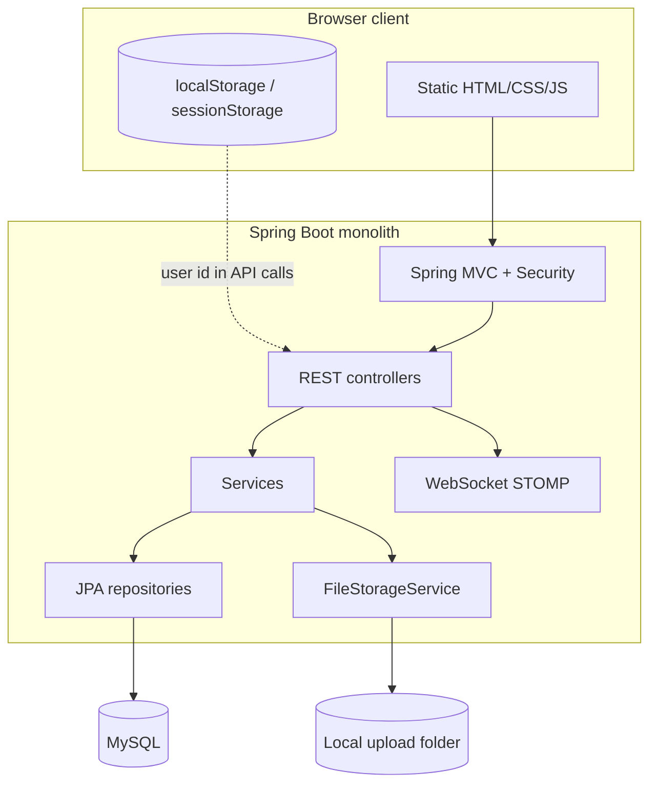
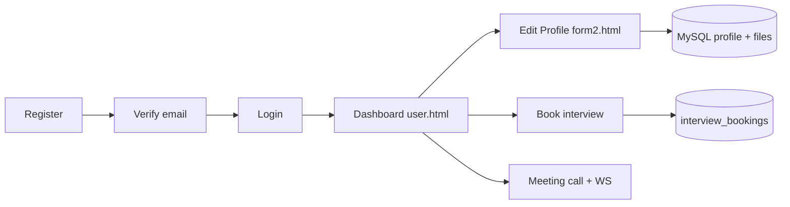
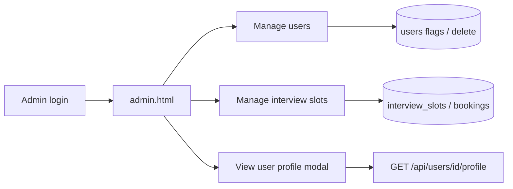
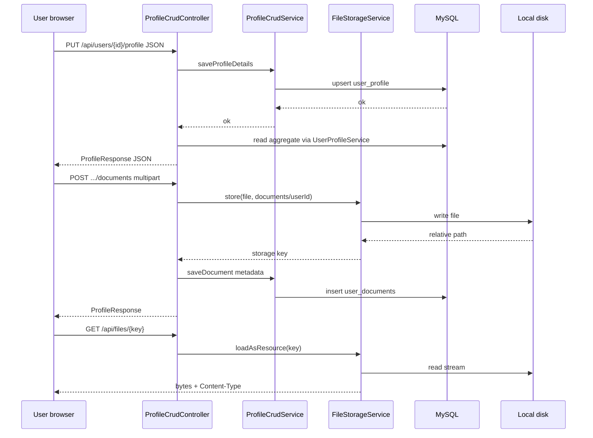
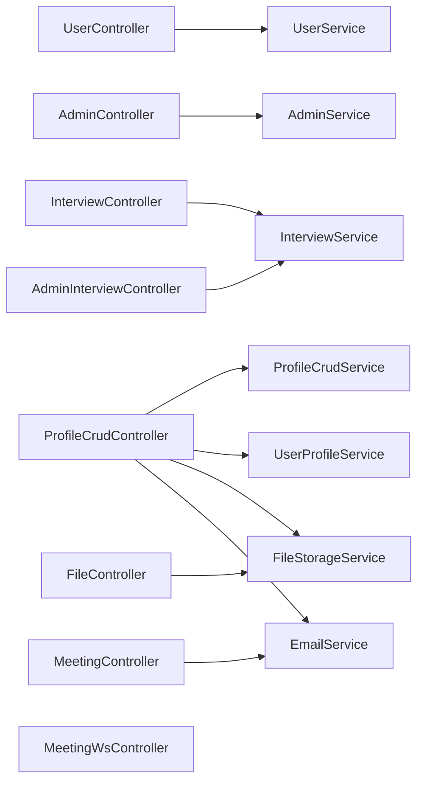
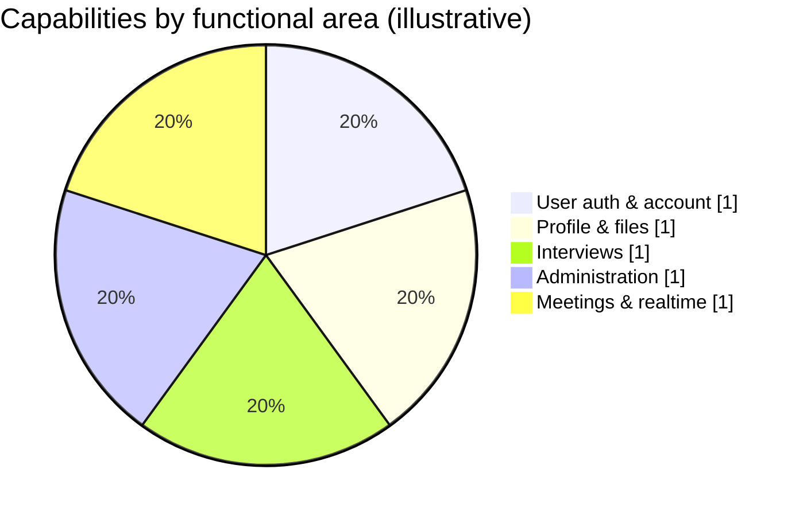

# Full Project Documentation

**Artifact:** `user-auth-admin` (`com.example:user-auth-admin:0.0.1-SNAPSHOT`)  
**Primary stack (intentional):** **Java 17**, **Spring Boot**, **Maven**, **MySQL**, **HTML**, **CSS**, **JavaScript** (vanilla JS; Chart.js / SockJS / STOMP loaded via `<script>` for charts and WebSocket). No Python, Node build step, or React/Next app in this repo.  
**Last analyzed:** 2026-04-04 (full codebase review, excluding generated `target/` and IDE metadata; documentation expanded with architecture diagrams, feature/role guide, and **§17** Chart.js chart-type reference for the user dashboard).

---

## 1. Project Overview

### Name and purpose

This repository is a **monolithic Spring Boot web application** that combines:

- **User authentication and lifecycle:** registration, email verification, login, account active/inactive state.
- **Administration:** admin login, listing users, activate/deactivate/delete users.
- **Interview scheduling:** admins create/delete time slots; users list slots, book, and cancel bookings; email notifications for book/cancel.
- **Rich user profiles:** CRUD for profile fields, education (including semester-wise qualification), experience, skills, programming languages, certificates, and documents, with **local file uploads** under `app.upload-dir`, served via `/api/files/...`.
- **Profile UX:** Edit Profile page (`information form/form2.html`) with document **preview** (images/PDF modal), programme (**B.Tech / Diploma / M.Tech**) stored as `current_course` on `user_profile` for dashboards and future analytics.
- **Global video meeting helpers:** in-memory “meeting active” flag, email blast when a meeting starts, ephemeral file upload/download for meeting assets, and **STOMP/WebSocket** signaling, chat, presence, and end notifications for a **single shared meeting** (no per-room persistence).

### Description

The backend exposes **REST JSON APIs** under `/api/...` and `/meeting/...`, serves **static pages** from `src/main/resources/static/`, and uses **MySQL** with **JPA/Hibernate** mapping to tables defined in SQL scripts. There is **no server-side session or JWT enforcement**; the browser stores user/admin identity in **localStorage** and passes `userId` in API calls. Spring Security is present but configured to **permit all requests** and disable CSRF.

A root **`package.json`** describes a **Next.js 15 / React 19** stack (Radix UI, Tailwind, etc.), but **there is no Next.js application source** (`app/`, `pages/`, etc.) in this repository. The **live UI** is the static HTML/CSS/JS under `static/`.

### 1.1 Feature catalogue (what the system does)

| Area | Features |
|------|----------|
| **Accounts** | User registration, email verification link, login; admin login (separate credentials in `admin` table). |
| **Admin — users** | List users, activate/deactivate, delete (cascades profile and related data). View user profile modal (read-only): personal info, programme, education, experience, skills, PLs, certificates, **documents with preview/thumbnails**. |
| **Admin — interviews** | Create/delete interview slots; list all bookings. |
| **User — interviews** | List slots, book, cancel; emails on book/cancel (when SMTP configured). |
| **User — profile** | Edit names, contact, gender, DOB, location, LinkedIn/GitHub; profile photo; **current course** (btech/diploma/mtech); semester-wise marks/CGPA/files; manual education rows; experience; programming languages; skills; certificates; general documents. |
| **Files** | Stored under configurable **`app.upload-dir`** on the server; MySQL stores relative path keys (e.g. `documents/5/...`). Download/view via **GET `/api/files/{*path}`** with sensible `Content-Type`. |
| **Meetings** | Global meeting on/off (`/meeting/start` / `end`), email blast to verified active users, ephemeral meeting file upload, **WebSocket** chat/signal/presence on `/ws`. |
| **Profile analytics** | **Chart.js** dashboards on **`user.html`**, **`user-profile.html`**, and **`admin-talent.html`**: aggregates from MySQL (education trend, skills mix, languages, section counts, radar vs cohort). **REST** loads data; **STOMP** pushes updates after profile saves (`/topic/analytics/user/{userId}`, `/topic/analytics/talent-refresh`). |

### 1.2 How end users use the system

1. Open **`/register.html`** → register → verify email via link → **`/login.html`** → lands on **`user.html`** (dashboard).  
2. **Dashboard** shows account info, **profile summary** (including programme, education cards, documents with image thumbnails, etc.), and interview slots to book/cancel.  
3. **Profile** (`user-profile.html`) and **Edit Profile** (`user-profile-edit.html` → `information form/form2.html`): fill sections and use **Save Profile** (main fields + programme), **Save** per row where shown, **Save semester** for qualification, **Upload** for documents/photo.  
4. **Meeting Call** pages join the shared meeting when admin has started it; WebSocket handles real-time messaging/signaling.

**Client state:** `sessionStorage` / `localStorage` holds JSON `user` after login (`id`, `username`, `email`, `verified`). APIs use **`/api/users/{userId}/...`** with that `id` (server does not validate ownership — see §9).

### 1.3 How admins use the system

1. **`/admin-login.html`** → POST **`/api/admin/login`** → on success, UI stores admin identity locally and opens **`admin.html`**.  
2. **Users tab:** search/filter, activate/deactivate/delete; **View profile** opens modal loading **`GET /api/users/{id}/profile`** (same aggregate as user sees).  
3. **Interviews tab:** create slots (title, time, duration, capacity), delete slots, view bookings.  
4. **Meeting (if used):** start/end global meeting from admin UI; users see dashboard banner when active.
5. **Talent / analytics:** open **`admin-talent.html`** — ranked profile scores and CGPA bars; pick a user to see **radar vs cohort**; list refreshes when any user updates their profile (WebSocket).

#### At-a-glance: user vs admin

| | **End user** | **Admin** |
|--|--------------|-----------|
| **Entry** | `/register.html` → verify → `/login.html` → `user.html` | `/admin-login.html` → `admin.html` |
| **Identity in browser** | `localStorage` user JSON (`id`, email, …) | `localStorage` admin JSON |
| **Typical tasks** | Edit profile & uploads, book/cancel interviews, join video meeting + chat | List/activate/delete users, create interview slots, view any user profile modal, start/stop global meeting |
| **API pattern** | `/api/users/{userId}/...`, `/api/interviews/...` | `/api/admin/...`, `/api/admin/interviews/...`, same profile read as user for modal |
| **Files** | Uploads via profile endpoints; view via `/api/files/...` | Sees user files in profile modal (same URLs) |
| **Charts** | Dashboard & profile pages show **insights + Chart.js** from `GET .../profile/analytics` | **Talent** page: `GET /api/admin/talent/analytics` + per-user radar via same user analytics JSON |

### 1.4 Recent enhancements (documentation + product)

| Topic | Behavior |
|-------|----------|
| **Profile PUT** | Full scalar update for `user_profile` (clear/replace fields consistently); photo upload uses a dedicated path that does not wipe other columns. |
| **`current_course`** | Column on `user_profile`: values `btech` / `diploma` / `mtech`; sent with **Save Profile**; shown on user dashboard and admin user modal; supports future charts/reports. |
| **Education level** | Semester saves and manual education saves attach **`education_level`** (B.Tech/Diploma/M.Tech) from the course dropdown where applicable. |
| **Local storage** | Upload root and subfolders created automatically; paths normalized to prevent directory escape. |
| **Files API** | `Content-Type` set for inline viewing (PDF/images); multipart limits raised in properties. |
| **Edit Profile UI** | Document list: **Preview** (modal) / **Open**; admin modal: thumbnails, PDF iframe, links. |
| **Errors** | `HttpMessageNotReadableException` → 400 with JSON hint for bad JSON/dates. |
| **Profile analytics (2026)** | `ProfileAnalyticsService` aggregates education, skills, PLs, counts, completeness, and **radar dimensions** vs cohort mean. `ProfileCrudController` triggers `AnalyticsStompPublisher` after each successful profile mutation. Front-end: **`common/profile-analytics.js`** + Chart.js CDN on user dashboard, user profile, and admin talent. |

### 1.5 Errors, risks, and verification (2026-04-04)

| Category | Finding | Severity / action |
|----------|---------|-------------------|
| **Build** | On the machine used for this review, **`mvn` was not on `PATH`**, so `mvn compile` could not be run here. Use IntelliJ “Build Project” or install Maven and run `mvn -q compile` locally to confirm. | Environment — verify on your PC |
| **IDE / static analysis** | No linter diagnostics reported for `src/main/java/com/example/authadmin`. | OK in Cursor |
| **Security** | APIs are **permit-all**; clients send `userId` — **IDOR** risk; admin routes are not authenticated server-side. | High — see §9, §15 |
| **Secrets in repo** | `application.properties` contains **default** DB and mail credentials in plain text. Treat as leaked if committed; use **env vars only** (`DB_PASSWORD`, `MAIL_PASSWORD`, etc.) and rotate. | High — rotate + env-only |
| **Unused dependency** | **JJWT** is in `pom.xml` but unused in Java code. | Low — remove or implement |
| **Orphan `package.json`** | Declares Next.js/React but **no app source** in repo; only static HTML UI is used. | Low — clarify or remove |
| **No automated tests** | `src/test/java` is empty. | Medium — add tests for critical flows |
| **Static asset naming** | User meeting page is `user-Meeting Call.html` (**space in filename**). Relative links work in most browsers but URLs are awkward; renaming to `user-meeting-call.html` would be safer. | Low |
| **Meeting scale** | Meeting state, presence, and ephemeral files are **in-memory per JVM** — not safe for multiple app instances without redesign. | Ops limitation — see §14 |

### 1.6 Local file storage

Uploads are stored **only on the server disk** under **`app.upload-dir`** (default `uploads/`, or `UPLOAD_DIR`). Subfolders such as `profile/<userId>/`, `documents/<userId>/`, etc. are created as needed. MySQL stores the **relative path** from that root.

---

## 2. Tech Stack

| Layer | Technology | Notes |
|--------|------------|--------|
| Language | Java 17 | |
| Framework | Spring Boot 3.3.3 | BOM-managed dependencies |
| Web | spring-boot-starter-web | REST + static resources |
| Real-time | spring-boot-starter-websocket | STOMP broker, SockJS endpoint `/ws` |
| Security | spring-boot-starter-security | Filter chain: permit-all, CSRF off |
| Data | spring-boot-starter-data-jpa | Repositories, Hibernate |
| Validation | spring-boot-starter-validation | Bean validation on selected DTOs |
| Mail | spring-boot-starter-mail | `JavaMailSender`, plain text emails |
| DB driver | mysql-connector-j | Runtime |
| Password hashing | BCrypt (`BCryptPasswordEncoder` in services) | Not registered as a Spring `@Bean` (local instances) |
| JWT library | jjwt 0.11.5 (api + impl + jackson) | **Declared in `pom.xml`; no usage in `src/main/java`** |
| Lombok | 1.18.30 | Provided scope (entities/DTOs use explicit getters/setters in practice) |
| Build | Maven | **`spring-boot-starter-parent`** 3.3.3 (standard layout + managed versions); `spring-boot-maven-plugin` |
| Database | MySQL | Default URL DB name: `interview_scheduling_db` |
| Frontend | HTML, CSS, JavaScript | Pages under `src/main/resources/static/`; optional CDN scripts (Chart.js, SockJS, STOMP) are plain JS. |
| Root `package.json` | Not used by Maven | Leftover Next.js-style manifest only — **not** part of the build; the live UI is static HTML/CSS/JS. |

**Tools:** IntelliJ IDEA project files (`.idea/`) present. **No Python** and **no Node/npm build** is required to run this application.

---

## 3. Project Structure

| Path | Role |
|------|------|
| `pom.xml` | Maven dependencies and build |
| `package.json` | Unused Next.js-style dependency manifest (no linked app code) |
| `src/main/java/com/example/authadmin/Application.java` | Spring Boot entry point |
| `config/` | `SecurityConfig`, `WebSocketConfig`, `WebSocketEvents`, `GlobalExceptionHandler`, `DataLoader` |
| `controller/` | REST and WebSocket message handlers |
| `service/` | Business logic |
| `repository/` | Spring Data JPA interfaces |
| `entity/` | JPA entities |
| `dto/` | Request/response payloads |
| `src/main/resources/application.properties` | Configuration |
| `src/main/resources/schema.sql` | DDL for core tables |
| `src/main/resources/schema-migration.sql` | Idempotent `ALTER TABLE` for column additions |
| `src/main/resources/data.sql` | Optional seed data (demo user id 1 profile rows) |
| `src/main/resources/static/` | Login, user dashboard, admin UI, meeting pages, CSS/JS |
| `target/` | **Build output** — exclude from source analysis |

---

## 4. Architecture

### Type

**Layered monolith** with a **thin controller → service → repository** flow and **server-rendered static assets** co-hosted with the API.

- **Not** MVC in the JSP sense: no view templates; controllers return JSON or redirect.
- **Not** microservices: single deployable JAR.
- **Not** API-gateway separated from UI: same origin for static files and REST.

### Layers

1. **Presentation:** `@RestController`, `@Controller` (WebSocket), static HTML/JS.
2. **Application:** `@Service` classes (transactions on profile/delete flows).
3. **Persistence:** JPA entities + `JpaRepository` interfaces.
4. **Cross-cutting:** `GlobalExceptionHandler`, security filter chain, WebSocket session disconnect handling.

### Data flow (text diagram)

```
Browser (static/*.html + JS)
    │  HTTP: fetch() → JSON REST (/api/*, /meeting/*)
    │  HTTP: GET static assets, GET /api/files/*, GET /meeting/files/*
    │  WS: SockJS → /ws → STOMP subscribe /topic/... send /app/...
    ▼
Spring MVC + Security (permit all)
    ▼
Controllers
    ▼
Services (UserService, InterviewService, ProfileCrudService, Meeting*, EmailService, …)
    ▼
Repositories → MySQL
    │
    ├─ FileStorageService → local disk (app.upload-dir)
    └─ MeetingService → java.io.tmpdir/intern-pro/meetings/global (in-memory index)
```

### 4.0 Architecture (ASCII — works without Mermaid)

```
                    +------------------+
                    |  Browser (HTML/  |
                    |  JS, localStorage)|
                    +--------+---------+
                             | HTTP + WebSocket (/ws)
                             v
+------------------------------------------------------------------+
|                     Spring Boot monolith                          |
|  Security (permit all) -> Controllers -> Services -> Repositories |
|  FileStorageService -----> local folder (app.upload-dir)          |
|  Meeting* services -> temp files + in-memory state                |
|  STOMP / WebSocket -> chat, presence, signaling                   |
+--------|------------------------------|--------------------------+
         |                              |
         v                              v
    +---------+                   +-------------+
    |  MySQL  |                   | Local files |
    |  (JPA)  |                   | (upload dir)|
                                  +-------------+
```

### 4.1 Layered architecture (diagram)



### 4.2 User journey (high level)



### 4.3 Admin journey (high level)



### 4.4 Profile save and file storage (sequence)



### 4.5 Main modules (dependency view)



### 4.6 Feature areas (illustrative)

The following chart is **not** a runtime metric; it groups major capabilities for onboarding and planning (e.g. charts/analytics later).



### Component interactions (high level)

- **User registration/login** → `UserController` → `UserService` → `UserRepository`; email via `EmailService`.
- **Admin** → `AdminController` → `AdminService` / `UserService`.
- **Interviews** → `InterviewController` / `AdminInterviewController` → `InterviewService` → slot/booking repos + mail.
- **Profiles** → `ProfileCrudController` → `ProfileCrudService` + `UserProfileService` + `FileStorageService`.
- **Meetings (HTTP)** → `MeetingController` → `MeetingStateService`, `MeetingService`, `UserRepository`, `EmailService`.
- **Meetings (WS)** → `MeetingWsController` + `WebSocketEvents` → `MeetingPresenceService` + `SimpMessagingTemplate`.

---

## 5. API Documentation

Base URL (default): `http://localhost:8080`

Unless noted, responses are JSON. **Authentication:** none on the server; clients send `userId` or act as admin based on local UI state.

### 5.1 Page / redirect

| Method | Path | Description |
|--------|------|-------------|
| GET | `/` | Redirects to `/login.html` (`HomeController`) |

### 5.2 Users — `/api/users`

| Method | Path | Request | Response |
|--------|------|---------|----------|
| POST | `/api/users/register` | Body: `RegisterRequest` JSON — `username`, `email`, `password` (validated: email format, password length 6–100) | **201** `UserResponse`: `id`, `username`, `email`, `verified` |
| GET | `/api/users/verify?token=` | Query: `token` | **302** redirect to `/login.html` (both success and failure — see Issues) |
| POST | `/api/users/login` | Body: `LoginRequest` — `email`, `password` | **200** `UserResponse` or **401** plain text: invalid credentials / not verified |
| GET | `/api/users/{id}` | Path: user id | **200** `UserResponse` or **404** string |

### 5.3 Admin — `/api/admin`

| Method | Path | Request | Response |
|--------|------|---------|----------|
| POST | `/api/admin/login` | Body: `adminId`, `password` | **200** plain string `"OK"` or **401** invalid credentials |
| GET | `/api/admin/users` | — | **200** array of `AdminUserResponse` (`id`, `username`, `email`, `verified`, `active`) |
| POST | `/api/admin/users/{id}/activate` | Path: user id | **200** `AdminUserResponse` |
| POST | `/api/admin/users/{id}/deactivate` | Path: user id | **200** `AdminUserResponse` |
| DELETE | `/api/admin/users/{id}` | Path: user id | **204** no content |

### 5.4 User interviews — `/api/interviews`

| Method | Path | Request | Response |
|--------|------|---------|----------|
| GET | `/api/interviews/slots` | — | JSON array `SlotResponse`: `id`, `title`, `description`, `scheduledAt`, `durationMinutes`, `capacity` (`bookedCount` not set for user list) |
| GET | `/api/interviews/bookings/user/{userId}` | Path: user id | Array `BookingResponse` |
| POST | `/api/interviews/slots/{slotId}/book` | Body: `{ "userId": number }` | `BookingResponse` |
| POST | `/api/interviews/bookings/{bookingId}/cancel` | Body: `{ "userId": number }` | **200** with empty body (`void`) |

**Booking rules (server):** user must exist, be verified and active; slot must exist; no duplicate BOOKED row for same slot+user; capacity checked against count of `BOOKED`. Cancel: booking must belong to `userId`; status set to `CANCELLED` if was `BOOKED`.

### 5.5 Admin interviews — `/api/admin/interviews`

| Method | Path | Request | Response |
|--------|------|---------|----------|
| GET | `/api/admin/interviews/slots` | — | `SlotResponse[]` with `bookedCount` populated |
| POST | `/api/admin/interviews/slots` | Body: `CreateSlotRequest` — `title`, `description?`, `scheduledAt` (ISO local datetime string), `durationMinutes` (validated `@Min(15)`), `capacity` (`@Min(1)`) | `SlotResponse` with `bookedCount: 0` |
| DELETE | `/api/admin/interviews/slots/{id}` | Path: slot id | Empty **200** (`void`) — deletes bookings for slot then slot |
| GET | `/api/admin/interviews/bookings` | — | All `BookingResponse` |

**Note:** `AdminInterviewController` does not use `@Valid` on `CreateSlotRequest`; invalid payloads may fail at parse time or produce inconsistent validation vs a strict API contract.

### 5.6 User profile CRUD — `/api/users/{userId}/...`

All successful mutating operations return **200** with full `ProfileResponse` (see DTO structure in §6 mental model: nested `profile`, `certificates`, `documents`, `education`, `experience`, `skills`, `programmingLanguages`).

| Method | Path | Content-Type | Parameters / body |
|--------|------|----------------|---------------------|
| GET | `/api/users/{userId}/profile` | — | — |
| PUT | `/api/users/{userId}/profile` | `application/json` | `SaveProfileRequest` — names, `contactNumber`, `gender`, `dob`, `country`, `state`, `city`, `linkedinUrl`, `githubUrl`, **`currentCourse`** (`btech` / `diploma` / `mtech` or null) |
| POST | `/api/users/{userId}/profile/photo` | `multipart/form-data` | `file` — stores under `profile/{userId}/`, updates profile image path |
| POST | `/api/users/{userId}/education` | `multipart/form-data` | Optional `file`; form fields: `id?`, `collegeName`, `branch`, `educationLevel`, `semester`, `startYear`, `endYear`, `totalMarks`, `marksObtained`, `cgpa` |
| DELETE | `/api/users/{userId}/education/{id}` | — | — |
| POST | `/api/users/{userId}/experience` | `multipart/form-data` | Optional `file`; `id?`, `companyName`, `jobRole`, `description`, `startDate`, `endDate` |
| DELETE | `/api/users/{userId}/experience/{id}` | — | — |
| POST | `/api/users/{userId}/programming-languages` | `multipart/form-data` | Optional `file`; `id?`, `languageName`, `proficiencyLevel`, `certificateCompany` |
| DELETE | `/api/users/{userId}/programming-languages/{id}` | — | — |
| POST | `/api/users/{userId}/certificates` | `multipart/form-data` | Optional `file`; `id?`, `certificateName`, `issuer`, `issueDate` |
| DELETE | `/api/users/{userId}/certificates/{id}` | — | — |
| POST | `/api/users/{userId}/documents` | `multipart/form-data` | Required `file`; optional `id`, `documentName` (defaults to original filename) |
| DELETE | `/api/users/{userId}/documents/{id}` | — | — |
| POST | `/api/users/{userId}/skills` | `application/x-www-form-urlencoded` or form | `id?`, `skillName`, `skillLevel` |
| DELETE | `/api/users/{userId}/skills/{id}` | — | — |
| GET | `/api/users/{userId}/profile/analytics` | — | **`UserAnalyticsResponse`** JSON: counts, `educationTrend[]`, `skillLevelDistribution`, `programmingLanguages`, `sectionCounts`, `insights[]`, `radarCompare` (user vs cohort means) |

Photo upload response includes JSON map: `path`, `url` (`/api/files/` + path).

**Admin talent pool**

| Method | Path | Response |
|--------|------|----------|
| GET | `/api/admin/talent/analytics` | **`TalentPoolResponse`**: `users[]` (`userId`, `username`, `displayName`, `profileCompleteness`, `averageCgpa`, counts, …) sorted by completeness; `cohortRadarAverages` (mean radar axes across all users, for reference) |

### 5.7 File download — `/api/files`

| Method | Path | Description |
|--------|------|-------------|
| GET | `/api/files/{*path}` | Serves file from **local** upload root (`app.upload-dir`). Sets `Content-Type` when detectable. `Content-Disposition: inline`. Paths normalized under upload root. **404** if missing. |

### 5.8 Meeting (HTTP) — `/meeting`

| Method | Path | Request | Response |
|--------|------|---------|----------|
| POST | `/meeting/start` | — | `{"status":"ACTIVE"}` — sets global flag; emails all **verified and active** users via `sendMeetingStartedEmail` |
| GET | `/meeting/status` | — | `{"active": boolean}` |
| POST | `/meeting/end` | — | `{"status":"INACTIVE"}` |
| POST | `/meeting/upload` | `multipart/form-data` `file` | `fileId`, `fileName`, `fileUrl` (`/meeting/files/{fileId}`) — stored under temp dir, metadata in memory |
| GET | `/meeting/files/{fileId}` | — | Binary stream with `Content-Type` from upload |

### 5.9 WebSocket / STOMP

| Item | Value |
|------|--------|
| SockJS endpoint | `/ws` (allowed origins `*`) |
| Broker prefix | `/topic` |
| Application prefix | `/app` |

**Client sends to (STOMP destination):**

| Destination | Payload type | Behavior |
|-------------|--------------|----------|
| `/app/meeting/signal` | `WsEnvelope` JSON | Broadcast to `/topic/meeting/signal` |
| `/app/meeting/chat` | `WsEnvelope` | Broadcast to `/topic/meeting/chat` |
| `/app/meeting/end` | `WsEnvelope` | Broadcast to `/topic/meeting/signal` (type/system kind end) |
| `/app/meeting/presence/join` | `PresencePayload` (`clientId`, `role`, `name`, `userId`) | Updates presence; broadcast list to `/topic/meeting/presence` |

**Subscribe:**

- `/topic/meeting/signal`
- `/topic/meeting/chat`
- `/topic/meeting/presence`
- `/topic/analytics/user/{userId}` — full **`UserAnalyticsResponse`** JSON after profile CRUD (Chart.js clients redraw)
- `/topic/analytics/talent-refresh` — `{ "type":"talent-refresh", "changedUserId": n }`; admin talent page refetches **`GET /api/admin/talent/analytics`**

**Server-driven:** `WebSocketEvents` on disconnect removes session from presence and rebroadcasts.

### 5.10 Middleware and filters

- **Spring Security:** single `SecurityFilterChain` — CSRF disabled, all requests permitted, HTTP basic and form login disabled.
- **No** JWT filter, **no** API key, **no** method-level security.
- **GlobalExceptionHandler** (`@RestControllerAdvice`) maps exceptions to HTTP status (see §12).

---

## 6. Database Documentation

### Engine and ORM

- **RDBMS:** MySQL.
- **ORM:** Hibernate via Spring Data JPA.
- **DDL:** `spring.jpa.hibernate.ddl-auto=none` — schema managed by SQL scripts, not auto-update.
- **Init:** `spring.sql.init.mode=always`, `continue-on-error=true`; `data-locations` = `schema-migration.sql`, `data.sql`. **Default** `schema.sql` is still the conventional schema script location unless `spring.sql.init.schema-locations` overrides it (not set in this project), so **`schema.sql` is expected to run on startup** for initialization alongside the configured data scripts (verify in your Spring Boot version if behavior differs).

### Tables and relationships

**users** — root entity for end users.

| Column | Type (SQL) | Notes |
|--------|------------|--------|
| id | INT PK AI | |
| username | VARCHAR(100) | |
| email | VARCHAR(255) UNIQUE | |
| password | VARCHAR(255) | BCrypt hash |
| verification_token | VARCHAR(255) | Cleared after verify |
| is_verified | BOOLEAN | |
| is_active | BOOLEAN | |
| created_at | TIMESTAMP | |

**admin**

| Column | Type | Notes |
|--------|------|--------|
| admin_id | VARCHAR(50) PK | e.g. `admin` |
| password | VARCHAR(255) | BCrypt hash |

**interview_slots**

| Column | Type | Notes |
|--------|------|--------|
| id | INT PK AI | |
| title | VARCHAR(150) | |
| description | VARCHAR(255) | |
| scheduled_at | DATETIME | |
| duration_minutes | INT | |
| capacity | INT | default 1 |
| created_at | TIMESTAMP | |

**interview_bookings**

| Column | Type | Notes |
|--------|------|--------|
| id | INT PK AI | |
| slot_id | INT FK → interview_slots | ON DELETE CASCADE |
| user_id | INT FK → users | ON DELETE CASCADE |
| status | VARCHAR(20) | e.g. BOOKED, CANCELLED |
| created_at | TIMESTAMP | |

Unique constraint: `(slot_id, user_id)`.

**user_profile** — one row per user (unique `user_id`).

| Column | Type | Notes |
|--------|------|--------|
| id | INT PK AI | |
| user_id | INT UNIQUE FK → users | |
| first_name, middle_name, last_name | VARCHAR | Entity uses length 50 on names |
| phone | VARCHAR(50) | Mapped as `contactNumber` in JPA |
| gender | VARCHAR(50) | |
| date_of_birth | DATE | Mapped as `dob` |
| country, state, city | VARCHAR(100) | |
| linkedin_url, github_url | VARCHAR(255) | |
| profile_image_path | VARCHAR(500) | |
| current_course | VARCHAR(50) | Programme: `btech`, `diploma`, `mtech` (for UI + future reporting) |
| created_at | TIMESTAMP | |

**user_certificates** — many per user.

| Column | Type |
|--------|------|
| id | INT PK AI |
| user_id | FK users |
| certificate_name, issuer | VARCHAR |
| issue_date | DATE |
| certificate_file | VARCHAR(255) |
| created_at | TIMESTAMP |

**user_documents**

| Column | Type |
|--------|------|
| id | INT PK AI |
| user_id | FK |
| document_name | VARCHAR(200) |
| file_path | VARCHAR(255) |
| uploaded_at | TIMESTAMP |

**user_education**

| Column | Type |
|--------|------|
| id | INT PK AI |
| user_id | FK |
| college_name, branch, education_level | VARCHAR |
| semester | INT |
| start_year, end_year | YEAR |
| total_marks, marks_obtained | INT |
| cgpa | DECIMAL(4,2) |
| document_path | VARCHAR(500) |
| created_at | TIMESTAMP |

**user_experience**

| Column | Type |
|--------|------|
| id | INT PK AI |
| user_id | FK |
| company_name, job_role | VARCHAR |
| start_date, end_date | DATE |
| description | TEXT |
| document_path | VARCHAR(500) |
| created_at | TIMESTAMP |

**user_programming_languages**

| Column | Type |
|--------|------|
| id | INT PK AI |
| user_id | FK |
| language_name | VARCHAR(100) |
| proficiency_level | VARCHAR(50) |
| certificate_company | VARCHAR(200) |
| certificate_file | VARCHAR(500) |
| created_at | TIMESTAMP |

**user_skills**

| Column | Type |
|--------|------|
| id | INT PK AI |
| user_id | FK |
| skill_name | VARCHAR(100) |
| skill_level | VARCHAR(50) |
| created_at | TIMESTAMP |

### Relationship summary

- **users 1 — 1 user_profile** (optional row).
- **users 1 — * ** user_certificates, user_documents, user_education, user_experience, user_programming_languages, user_skills, interview_bookings.
- **interview_slots 1 — * interview_bookings**.

---

## 7. Database Architecture

The schema follows a **single-database, normalized** design: `users` is the hub; profile data is **vertical partitioning** into child tables to avoid wide sparse rows. Interview data is isolated in `interview_slots` and `interview_bookings` with explicit FKs and cascade deletes.

**Migration strategy:** New columns (education marks/CGPA, document paths, programming-language certificate fields, **`user_profile.current_course`**, etc.) are added via `schema-migration.sql` with `continue-on-error` so reruns on already-migrated DBs do not fail startup.

**Seed data:** `data.sql` targets **user_id = 1** with idempotent patterns (`INSERT IGNORE`, `WHERE NOT EXISTS`). Safe only if that user exists.

---

## 8. Core Business Logic

| Area | Logic |
|------|--------|
| Registration | Reject duplicate email (`IllegalStateException` → 409 via handler); hash password; UUID verification token; send verification email. |
| Verification | Find by token; set verified, clear token. |
| Login | Email lookup; require verified + active + password match. |
| Admin auth | Load admin by id; BCrypt match. |
| User delete | Transactional: delete interview bookings for user, all profile child rows, then user (repos `deleteByUserId` where defined). |
| Interview book | Capacity = count `BOOKED`; unique booking per slot+user enforced in service + DB unique key. |
| Interview cancel | Ownership check; email on cancel. |
| Profile header (PUT `/profile`) | **Full scalar replace** on `user_profile` from JSON (including `current_course`). Photo uses a separate endpoint that only updates `profile_image_path` (and deletes previous local file when replaced). |
| Profile sub-resources | Create vs update by optional `id` on education, experience, etc.; file paths stored as **local** relative paths under `app.upload-dir`. |
| Meeting start | In-memory flag; iterate **all** users — email only verified+active. |
| Meeting files | In-memory map `fileId → path`; files on disk under JVM temp; **lost on restart**. |
| Presence | Concurrent map keyed by WebSocket session id; join updates and broadcast; disconnect removes. |

---

## 9. Authentication and Security

| Mechanism | Status |
|-----------|--------|
| JWT | Dependency only — **not implemented** |
| Session / cookies | Not used for API auth |
| HTTP Basic / form login | Disabled in security config |
| CSRF | Disabled globally |
| Authorization | **None** — any client can call admin or user APIs if they know URLs and ids |
| Password storage | BCrypt in `UserService`, `AdminService`, `DataLoader` |
| Email verification | Token in DB + link to GET `/api/users/verify` |

**Risks:** IDOR on all `/api/users/{userId}/...` and interview cancel/book; admin endpoints are public; **secrets in `application.properties`** (see §10 and §15).

---

## 10. Environment Variables

Configurable via Spring placeholders (defaults shown in `application.properties`):

| Variable | Purpose |
|----------|---------|
| `DB_URL` | JDBC URL |
| `DB_USERNAME` | MySQL user |
| `DB_PASSWORD` | MySQL password |
| `UPLOAD_DIR` | Local directory for profile/uploads (`app.upload-dir`) |
| `MAIL_HOST` | SMTP host |
| `MAIL_PORT` | SMTP port |
| `MAIL_USERNAME` | SMTP user |
| `MAIL_PASSWORD` | SMTP password |

**Also:** `app.base-url` is fixed to `http://localhost:${server.port}` in properties (not env-driven); used in email links.

---

## 11. Dependencies

### Maven (`pom.xml`)

- `spring-boot-starter-web`
- `spring-boot-starter-websocket`
- `spring-boot-starter-security`
- `spring-boot-starter-data-jpa`
- `spring-boot-starter-validation`
- `spring-boot-starter-mail`
- `mysql-connector-j` (runtime)
- `jjwt-api`, `jjwt-impl`, `jjwt-jackson` (0.11.5)
- `lombok` (provided)
- `spring-boot-starter-test` (test)
- `spring-security-crypto`

### npm (`package.json`) — not wired to Java build

Key entries: `next` 15.5.4, `react` 19.1.0, Radix UI packages, `tailwindcss` 4.x, `zod`, `react-hook-form`, etc.

---

## 12. Error Handling and Logging

**`GlobalExceptionHandler`:**

| Exception | HTTP | Body shape |
|-----------|------|------------|
| `MethodArgumentNotValidException` | 400 | `error`, `fields` map |
| `HttpMessageNotReadableException` | 400 | `error: bad_request`, `message` (e.g. invalid JSON / date) |
| `BindException` | 400 | `error: bind_failed` |
| `IllegalStateException` | 409 | `error: conflict`, `message` |
| `DataIntegrityViolationException` | 409 | `error: data_integrity`, `message` (logged warn) |
| `NoResourceFoundException` | 404 | empty |
| `Exception` | 500 | `error: internal_error`, `message` (logged error) |

**Email:** `EmailService.sendSafe` swallows exceptions so SMTP failures do not break registration/meeting flows.

**Logging:** SLF4J in `GlobalExceptionHandler`; broad `Exception` handler logs stack traces at error level.

---

## 13. Testing

- **`spring-boot-starter-test`** is on the classpath.
- **No test sources** under `src/test/java` in this repository (no automated tests present).

---

## 14. Deployment

### Build

```bash
mvn -q clean package
```

Produces a runnable JAR via `spring-boot-maven-plugin` (standard Spring Boot layout).

### Runtime prerequisites

- Java 17+
- MySQL with database created and reachable; run or rely on `schema.sql` + migration + optional `data.sql` per your init settings.
- Writable directory for `UPLOAD_DIR`.
- SMTP credentials if email is required (optional for dev — failures are swallowed).

### Frontend

Static files are served from the classpath; **no separate Node build** is required for the current UI.

### Horizontal scaling

**Not supported without changes:** meeting state, presence, and meeting file metadata are **in-memory per JVM**.

---

## 15. Issues and Improvements

1. **Security:** Permit-all configuration and client-trusted `userId` enable **IDOR and unauthorized admin access**. Add authentication (e.g. session or JWT), role checks, and server-side authorization on every mutating route.
2. **Secrets:** Database password and mail password appear as **defaults in `application.properties`**. Remove from VCS; use env-only secrets and rotate any exposed credentials.
3. **JWT dependency:** Unused — remove or implement consistently.
4. **Email verification redirect:** `UserController.verify` returns **302 to login for both success and failure**; users cannot see verification outcome without changing the implementation.
5. **CSRF:** Disabled for the whole app; if cookies/sessions are introduced, re-enable CSRF or use token pattern.
6. **Admin slot creation:** `@Valid` not applied on `CreateSlotRequest` in `AdminInterviewController`.
7. **Unused code:** `MeetingDtos.CreateMeetingResponse`, `MeetingService.createRoomId()` — dead code.
8. **`package.json`:** Orphaned — either add the Next app or remove to avoid confusion.
9. **Tests:** Add integration tests for critical flows (register, verify, book, cancel, profile CRUD).
10. **Meeting persistence:** File and “active” state are volatile; document operational limits or persist to DB/object storage.
11. **Performance:** `/meeting/start` loads all users into memory for email; consider batching or async queue for large user bases.
12. **Filename with space:** `user-Meeting Call.html` — prefer a hyphenated name and update all `href`s for portability.

---

## Appendix: Main classes and modules

| Class | Responsibility |
|--------|----------------|
| `UserController` | User REST API |
| `AdminController` | Admin REST API |
| `InterviewController` | User interview API |
| `AdminInterviewController` | Admin interview API |
| `ProfileCrudController` | Profile multipart/JSON API |
| `FileController` | Uploaded file download |
| `MeetingController` | Meeting HTTP API |
| `MeetingWsController` | STOMP message handling |
| `UserService` | Users, verify, login, delete cascade |
| `AdminService` | Admin login |
| `InterviewService` | Slots, bookings, emails |
| `ProfileCrudService` | Profile subgraph persistence + file cleanup |
| `UserProfileService` | Aggregate profile read model |
| `FileStorageService` | Local disk under `app.upload-dir` |
| `ProfileAnalyticsService` | Builds chart-oriented DTOs from JPA aggregates (per user + talent pool) |
| `AnalyticsStompPublisher` | Pushes analytics payloads to STOMP topics after profile changes |
| `ProfileAnalyticsController` | `GET /api/users/{userId}/profile/analytics` |
| `EmailService` | Plain-text mail |
| `MeetingService` | Ephemeral meeting file store |
| `MeetingStateService` | Global boolean meeting active |
| `MeetingPresenceService` | In-memory presence list |
| `DataLoader` | Ensures default admin `admin` / password `admin` (BCrypt) on profiles `default`, `dev`, `mysql` |

---

*This document was produced by a full pass over Java sources, SQL scripts, `application.properties`, `pom.xml`, `package.json`, and static assets under `src/main/resources/static/`, with cross-checks for APIs, schema, and dependencies. **Mermaid diagrams** render in GitHub, GitLab, many IDEs, and VS Code preview; if your viewer does not support Mermaid, use the same sections as logical reference.*

---

## 16. Documentation diagram index

| Diagram (§4) | Purpose |
|--------------|---------|
| **4.1** Layered architecture | Browser ↔ Spring ↔ MySQL / local disk / WebSocket |
| **4.2** User journey | Register → verify → login → dashboard → profile / interviews / meeting |
| **4.3** Admin journey | Admin login → users / interviews / profile modal |
| **4.4** Profile & files sequence | PUT profile, POST document, GET file |
| **4.5** Module graph | Controllers → primary services |
| **4.6** Pie chart | Illustrative split of major capability areas |
| **§17** | Tabular reference: Chart.js types on user dashboard / profile / admin talent |

---

## 17. User dashboard charts and graphs (Chart.js)

### 17.1 Implementation status

**Implemented.** Charts use **real MySQL-backed profile data** aggregated on the server.

| Page | Section | When charts load |
|------|---------|------------------|
| **`user.html`** (User Dashboard) | **Insights & charts** | After **`loadProfileData()`** succeeds, **`User-js/user-dashboard.js`** calls **`ProfileAnalyticsUI.mountUserCharts(userId, '')`** (`common/profile-analytics.js`). |
| **`user-profile.html`** | Same block + same canvas ids | **`loadUserProfile()`** → same **`loadProfileData()`** path. |
| **`admin-talent.html`** | Talent pool rankings + per-user radar | **`ProfileAnalyticsUI.initAdminTalentPage()`** — **`GET /api/admin/talent/analytics`** and **`GET /api/users/{id}/profile/analytics`** for the selected user. |

**Libraries:** Chart.js **4.4.6** (UMD CDN), **SockJS** + **STOMP** for optional live updates.

**REST:** **`GET /api/users/{userId}/profile/analytics`** → `UserAnalyticsResponse` (`ProfileAnalyticsController` + `ProfileAnalyticsService`).

**WebSocket (optional refresh):** After any successful profile mutation, **`AnalyticsStompPublisher`** sends the same payload to **`/topic/analytics/user/{userId}`**; the dashboard client redraws charts. Admins can listen on **`/topic/analytics/talent-refresh`** to refetch the talent list.

### 17.2 Chart types shown on the user dashboard (and profile)

These are the **Chart.js** chart kinds created in **`common/profile-analytics.js`**. Each maps to a `<canvas>` on **`user.html`** / **`user-profile.html`**.

| # | Chart.js `type` | Canvas `id` | What it shows | Source fields in `UserAnalyticsResponse` |
|---|-----------------|---------------|---------------|-------------------------------------------|
| 1 | **`line`** | `chartCgpaLine` | Academic trend across education rows (by semester order): **CGPA** and/or **marks %** on one or two Y axes | `educationTrend[]` — `semester`, `cgpa`, `percentage`, `label` |
| 2 | **`doughnut`** | `chartSkillsDoughnut` | **Skills** grouped by **skill level** (e.g. Beginner / Intermediate / Advanced / Unspecified) | `skillLevelDistribution[]` — `name`, `value` |
| 3 | **`bar`** (horizontal, `indexAxis: 'y'`) | `chartPlBar` | One bar per **programming language** listed on the profile | `programmingLanguages[]` |
| 4 | **`bar`** (vertical) | `chartSectionsBar` | **Counts** of rows: Education, Experience, Skills, Languages, Certificates, Documents | `sectionCounts[]` |
| 5 | **`radar`** | `chartRadar` | **You vs cohort:** five axes (Profile completeness, Academic, Skills breadth, Experience, Credentials), scaled 0–100 | `radarCompare` — `labels`, `userScores`, `cohortScores` |

**Empty states:** If there is no usable education trend data, a hint under **`chartCgpaLine`** can be shown (`chart-empty-hint`). Doughnut / PL bar / section bar / radar are skipped when the corresponding arrays are empty (no chart instance for that canvas).

### 17.3 Text insights (non-chart)

**`insights[]`** is a list of short strings computed on the server (e.g. profile completeness, CGPA commentary, suggestions to add languages or experience). Rendered in **`#analyticsInsights`** below the grid.

### 17.4 Admin talent page (extra chart types)

On **`admin-talent.html`**, the same script adds:

| Chart.js `type` | Canvas `id` | Purpose |
|-----------------|-------------|---------|
| **`bar`** (horizontal) | `adminTalentRankBar` | Top users by **`profileCompleteness`** (`TalentPoolResponse.users`) |
| **`bar`** (horizontal) | `adminTalentCompareBar` | **Average CGPA** where present (subset of users) |
| **`radar`** | `adminTalentRadar` | Selected user from dropdown — same **`radarCompare`** as dashboard vs cohort |

### 17.5 Backend and front-end files

| Role | Path |
|------|------|
| Aggregate + radar vs cohort | `ProfileAnalyticsService.java` |
| REST | `ProfileAnalyticsController.java` — `GET .../profile/analytics` |
| DTOs | `AnalyticsDtos.java` |
| STOMP push after profile save | `AnalyticsStompPublisher.java` — wired from `ProfileCrudController` |
| Chart rendering + STOMP subscribe | `src/main/resources/static/common/profile-analytics.js` |
| Script includes + layout | `user.html`, `user-profile.html` (Chart.js + SockJS + STOMP + `profile-analytics.js`) |

### 17.6 Approved technology stack and IntelliJ tips

**Use only:** Java 17, Spring Boot, Maven, MySQL, HTML, CSS, JavaScript (including Chart.js / SockJS / STOMP via script tags). No Python, no Node/npm build for this app.

If IntelliJ shows **package does not exist** for Spring or Jakarta: reload **Maven** on pom.xml, set **Project SDK** to **17**, then **Invalidate Caches** if needed. Do not paste compiler output into this file.