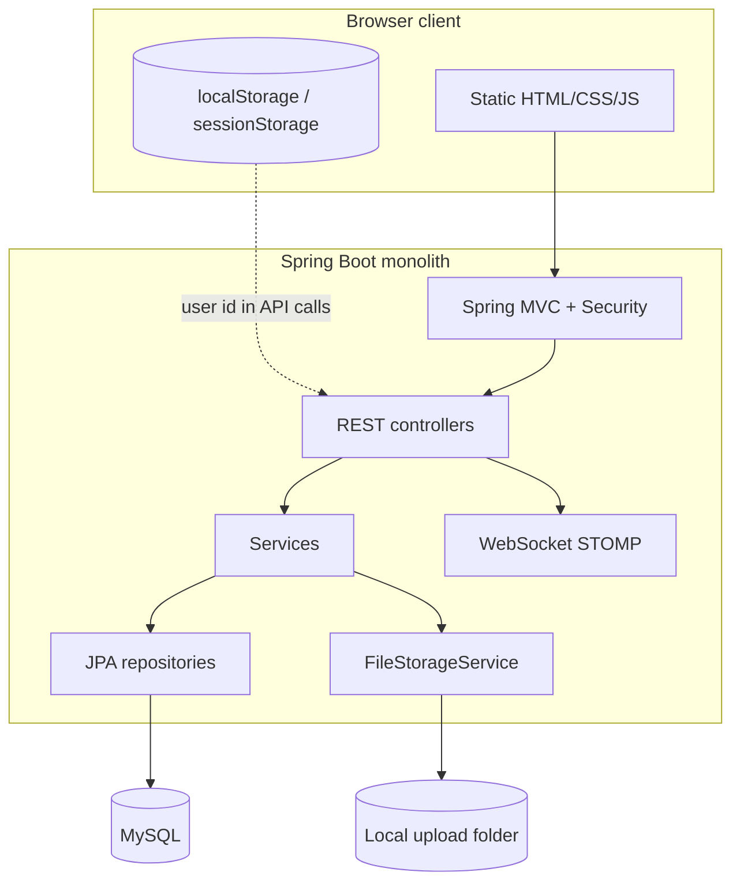
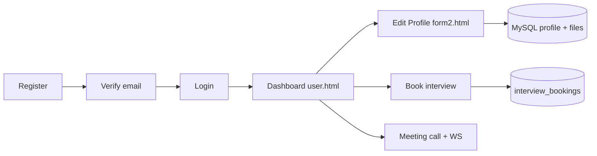
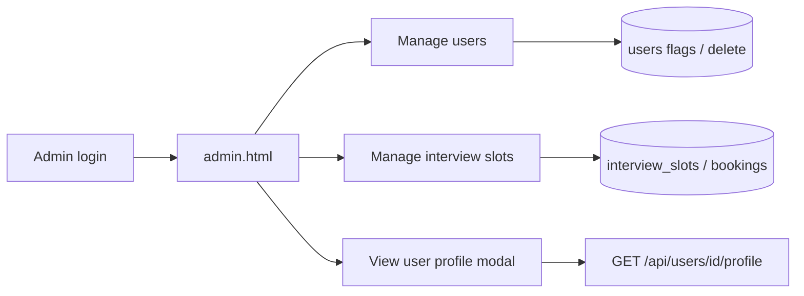
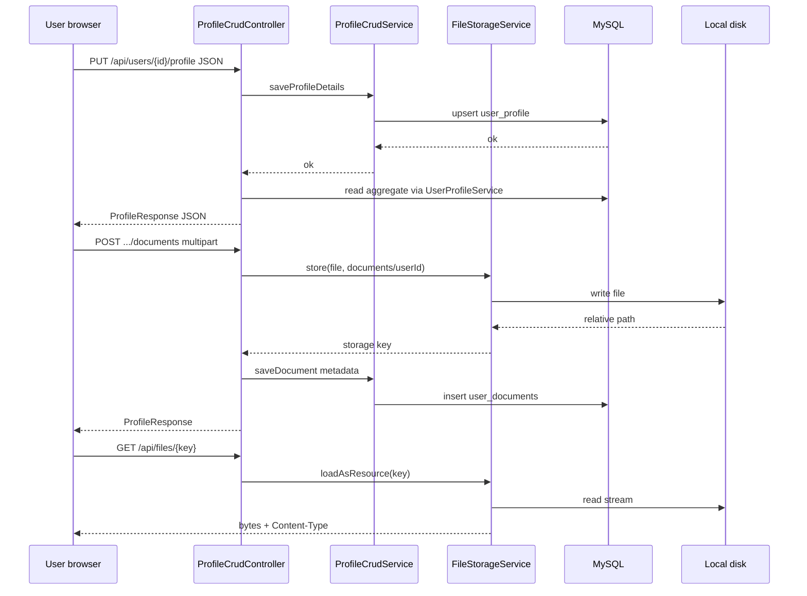
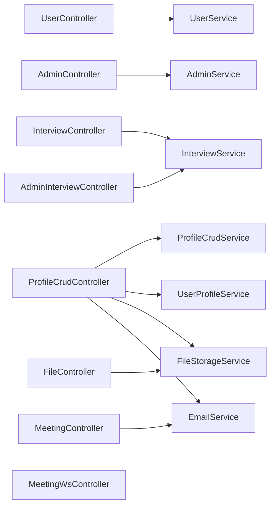
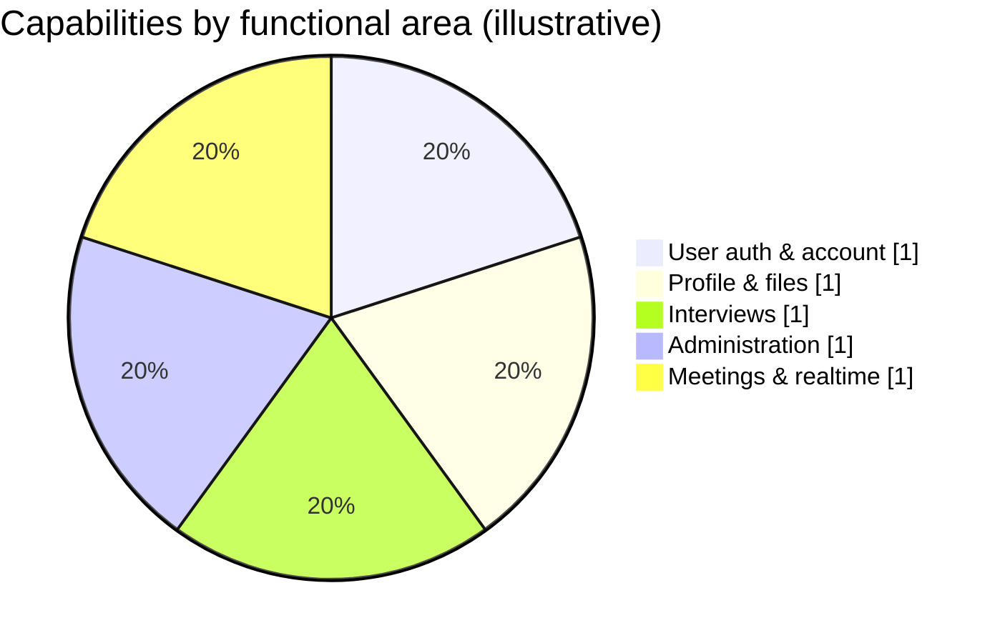

### Interview Scheduling Tool


## 📌 Overview

Recruitment processes are often fragmented across multiple tools—forms, spreadsheets, emails, and meeting platforms—leading to inefficiencies, inconsistent evaluations, and delays.

**Interview Scheduling Tool** eliminates this fragmentation by providing a **single, integrated system** that manages the complete recruitment lifecycle:

- Candidate onboarding
- Interview scheduling
- Real-time interview execution
- Evaluation and analytics

---

## 🎯 Key Features

### 👨‍🎓 Candidate Module

- Secure registration with email verification
- Authentication & login system
- Profile management:
  - Education
  - Experience
  - Skills
  - Certifications
  - Document uploads
- Interview slot booking

### 🛠️ Admin Module

- User lifecycle management
- Interview scheduling & coordination
- Booking supervision
- Candidate tracking dashboard
- Analytics & report generation

---

## 🎥 Real-Time Interview System

- **WebRTC-based video/audio communication**
- **WebSocket + STOMP** for:
  - Signaling
  - Chat
  - Typing indicators
  - Presence tracking

### 🧠 AI-Powered Insights

- Speech-to-text transcription (Whisper-compatible service)
- Communication analytics:
  - Speaking rate
  - Filler word frequency
- Evidence-based evaluation system

---

## 💻 Technical Assessment

- Coding challenge support
- Integration with **Judge0 API** (when available)
- Fallback deterministic code evaluation engine

---

## 📊 Smart Evaluation System

Candidate ranking based on configurable weights:

- Communication skills
- Technical performance
- Behavioral analysis
- Profile strength

---

## 📄 Reporting

- Automated PDF report generation
- Optional email notifications
- Interview transcripts storage

---

## 🏗️ Architecture

This project follows a **Modular Monolithic Architecture**, ensuring:

- Simplicity in deployment
- High maintainability
- Scalability for future enhancements

---

## ⚙️ Tech Stack

### 🔙 Backend

- Java 17
- Spring Boot 3.3
- Spring Data JPA
- WebSocket (STOMP)
- REST APIs

### 🗄️ Database

- MySQL

### 🌐 Frontend

- HTML5
- CSS3
- JavaScript (Vanilla)

### 🔗 Real-Time & Media

- WebRTC
- WebSocket

### 🧠 AI & Processing

- Whisper (Speech-to-Text)
- Custom analytics engine

### 🧪 Code Evaluation

- Judge0 API (optional)
- Internal evaluation engine

---

## 📦 Deployment Model

- Single artifact (JAR)
- Backend serves frontend (no separate deployment)
- Ideal for:
  - Academic institutions
  - Small-scale enterprise setups

---


## 🔮 Future Enhancements

- 🔐 JWT-based authentication & authorization
- 🛡️ Object-level access control
- ⚡ Asynchronous processing (RabbitMQ / Kafka)
- ☁️ Migration to cloud object storage (AWS S3 / GCP)
- 📈 Advanced monitoring & logging (Prometheus, Grafana)
- 📊 Enhanced analytics dashboard
- 🤖 AI-based candidate recommendation system

---

## 📷 Screenshots

> Add your images inside an `images/` folder in your repo

### 4.1 Layered architecture (diagram)



### 4.2 User journey (high level)



### 4.3 Admin journey (high level)



### 4.4 Profile save and file storage (sequence)



### 4.5 Main modules (dependency view)



### 4.6 Feature areas (illustrative)

The following chart is **not** a runtime metric; it groups major capabilities for onboarding and planning (e.g. charts/analytics later).



---

## 📂 Project Structure

```
Interview-Scheduling-Tool/
|---main
    +---java
    |   \---com
    |       \---example
    |           \---authadmin
    |               |   Application.java
    |               |
    |               +---config
    |               |       DataLoader.java
    |               |       GlobalExceptionHandler.java
    |               |       SecurityConfig.java
    |               |       WebSocketConfig.java
    |               |       WebSocketEvents.java
    |               |
    |               +---controller
    |               |       AdminController.java
    |               |       AdminInterviewController.java
    |               |       FileController.java
    |               |       HomeController.java
    |               |       InterviewController.java
    |               |       MeetingController.java
    |               |       MeetingWsController.java
    |               |       ProfileCrudController.java
    |               |       UserController.java
    |               |       ProfileAnalyticsController.java
    |               |       InterviewUpgradeController.java
    |               |       MeetingSttController.java
    |               |
    |               +---dto
    |               |       AdminDtos.java
    |               |       InterviewDtos.java
    |               |       MeetingDtos.java
    |               |       ProfileDtos.java
    |               |       ProfileRequestDtos.java
    |               |       UserDtos.java
    |               |       AnalyticsDtos.java
    |               |       InterviewUpgradeDtos.java
    |               |
    |               +---entity
    |               |       Admin.java
    |               |       InterviewBooking.java
    |               |       InterviewSlot.java
    |               |       User.java
    |               |       UserCertificate.java
    |               |       UserDocument.java
    |               |       UserEducation.java
    |               |       UserExperience.java
    |               |       UserProfile.java
    |               |       UserProgrammingLanguage.java
    |               |       UserSkill.java
    |               |       MeetingChatMessage.java
    |               |       GeocodeCache.java
    |               |       AdminEmailLog.java
    |               |       InterviewSession.java
    |               |       RankingWeight.java
    |               |       CodingChallenge.java
    |               |       CodingSubmission.java
    |               |       FinalReport.java
    |               |
    |               +---repository
    |               |       AdminRepository.java
    |               |       InterviewBookingRepository.java
    |               |       InterviewSlotRepository.java
    |               |       UserCertificateRepository.java
    |               |       UserDocumentRepository.java
    |               |       UserEducationRepository.java
    |               |       UserExperienceRepository.java
    |               |       UserProfileRepository.java
    |               |       UserProgrammingLanguageRepository.java
    |               |       UserRepository.java
    |               |       UserSkillRepository.java
    |               |       MeetingChatRepository.java
    |               |       GeocodeCacheRepository.java
    |               |       AdminEmailLogRepository.java
    |               |       InterviewSessionRepository.java
    |               |       RankingWeightRepository.java
    |               |       CodingChallengeRepository.java
    |               |       CodingSubmissionRepository.java
    |               |       FinalReportRepository.java
    |               |
    |               \---service
    |                       AdminService.java
    |                       EmailService.java
    |                       FileStorageService.java
    |                       InterviewService.java
    |                       MeetingPresenceService.java
    |                       MeetingService.java
    |                       MeetingStateService.java
    |                       ProfileCrudService.java
    |                       UserProfileService.java
    |                       UserService.java
    |                       MeetingAdminTokenService.java
    |                       MeetingChatService.java
    |                       MeetingChatRateLimiter.java
    |                       MeetingRtcConfigService.java
    |                       ProfileAnalyticsService.java
    |                       AnalyticsStompPublisher.java
    |                       InterviewUpgradeService.java
    |                       MeetingSttService.java
    |
    \---resources
        |   application-mysql.properties
        |   application.properties
        |   data.sql
        |   schema-migration.sql
        |   schema.sql
        |
        \---static
            |   login.html
            |   register.html
            |
            +---common
            |       meeting.js
            |       profile-analytics.js
            |
            +---user
            |   |   user.html
            |   |   user-profile.html
            |   |   user-profile-edit.html
            |   |   user-live-coding.html
            |   |   user-Meeting Call.html
            |   |   user-appointments.html
            |   |
            |   +---css
            |   |       User-Chat-Metting.css
            |   |       user-dashboard.css
            |   |       User-metting.css
            |   |       user-profile-edit.css
            |   |
            |   +---js
            |   |       User-Chat-Metting.js
            |   |       user-dashboard.js
            |   |       User-metting.js
            |   |       user-profile-edit.js
            |   |
            |   \---profile-form
            |           college.js
            |           education.js
            |           experience.js
            |           form.css
            |           form2.html
            |           imageUpload.js
            |           programmingLanguages.js
            |           README.txt
            |           semesterFields.js
            |           skills.js
            |
            \---admin
                |   admin.html
                |   admin-appointments.html
                |   admin-fix-appointment.html
                |   admin-settings.html
                |   admin-meeting.html
                |   admin-talent.html
                |   admin-login.html
                |
                +---css
                |       admin-dashboard.css
                |       Admin-metting.css
                |       Chat-Metting.css
                |
                \---js
                        admin-dashboard.js
                        admin-metting.js
                        Chat-Metting.js
                        admin-fix-appointment.js
|    │── pom.xml
│── README.md
```

---

##  How to Run

```bash
# Clone the repository
git clone https://github.com/Tusharawale/interview-scheduling-tool.git

# Navigate to project
cd interview-scheduling-tool

# Run the application
mvn spring-boot:run
```

---

##  Why This Project Stands Out


---

##  Contribution


---

##  License


---

##  Author

**Tushar Awale**  
B.Tech (Computer Technology)

---


