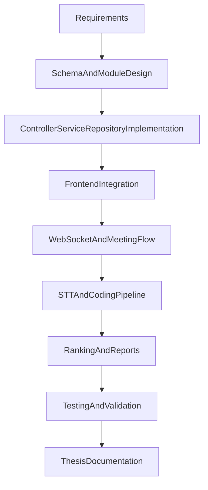
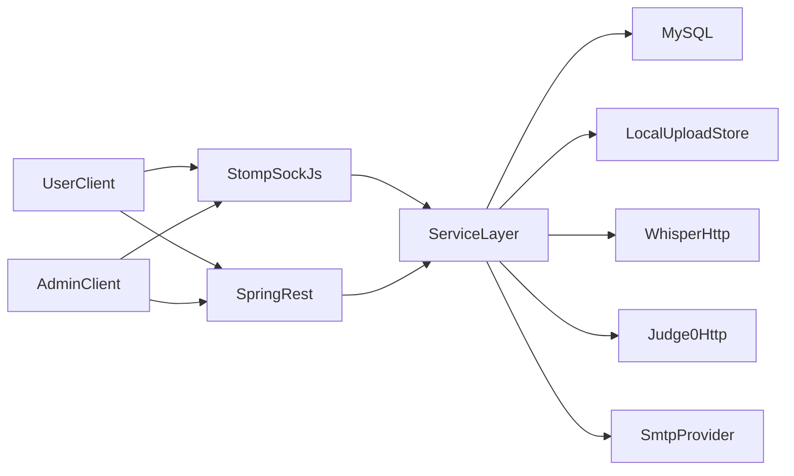
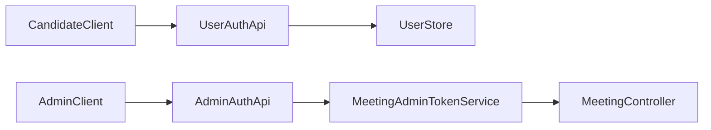
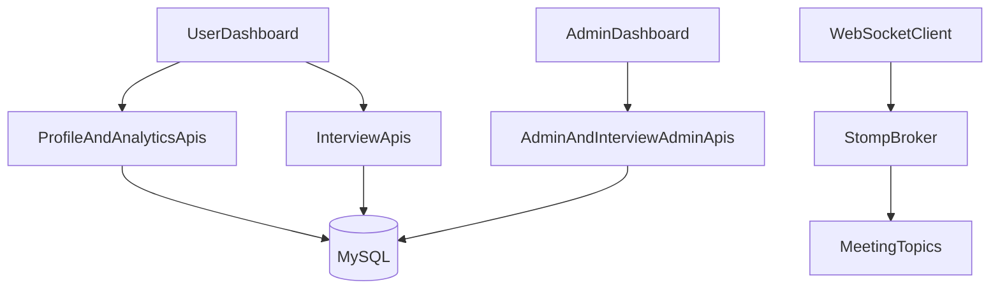
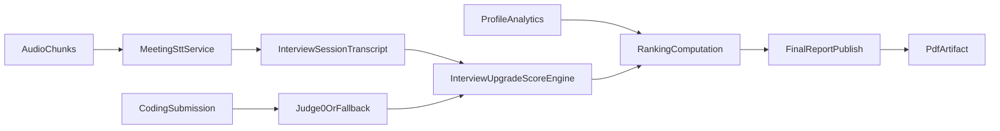
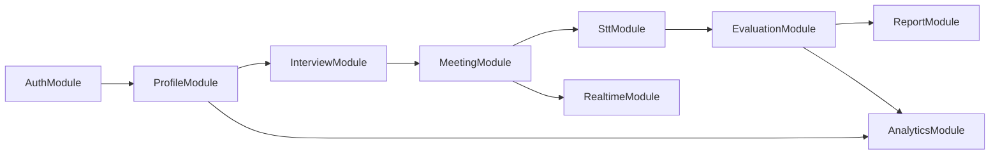

# Title Page

**Title of the Thesis:** Project4 — Integrated Interview Scheduling, Live Collaboration, and Evidence-Based Candidate Evaluation Platform

**Submitted in partial fulfillment of the requirements for the degree of**  
**[Bachelor of Technology / Master of Engineering / Program Name]**

**Submitted by**  
**[Candidate Full Name]**  
**[University Roll Number]**

**Under the guidance of**  
**[Supervisor Name, Designation]**  
**[Department, Institution Name]**

**[University Name]**  
**[City, Country]**  
**[Month Year]**

---

# Certificate

This is to certify that the thesis entitled **"Project4 — Integrated Interview Scheduling, Live Collaboration, and Evidence-Based Candidate Evaluation Platform"** submitted by **[Candidate Full Name]** ([Roll Number]) in partial fulfillment of the requirements for the award of **[Degree Name]** at **[University Name]** is a record of bona fide work carried out under my supervision.

The contents of this thesis have not been submitted elsewhere for the award of any other degree or diploma.

**[Supervisor Name]**  
**[Designation, Department]**  
**[University Name]**

**Date:** _______________  **Signature:** _______________

**[Head of Department]**  **[External Examiner, if applicable]**

---

# Acknowledgment

I express sincere gratitude to **[Supervisor Name]** for guidance, technical insight, and consistent encouragement throughout this work. I thank the faculty and staff of **[Department]** at **[University Name]** for creating an environment that supported project development, experimentation, and documentation.

I also acknowledge the open-source ecosystems used in this work, including Spring Boot, Spring WebSocket, Spring Data JPA, MySQL, WebRTC, and chart/PDF libraries that enabled practical implementation of analytics and reporting modules. Their maturity and documentation made it possible to build and evaluate an end-to-end interview platform within an academic timeline.

I thank my peers and family members for their support during design, coding, testing, and thesis preparation.

**[Candidate Full Name]**  
**[Date]**

---

# Chapter 1: Abstract

Recruitment systems in many academic and small-enterprise environments are fragmented across multiple tools: registration forms, spreadsheets, mailing threads, meeting links, and manually maintained score sheets. This fragmentation often introduces inconsistent evaluation standards, delayed decision-making, weak traceability, and duplicated operational effort. The objective of Project4 is to unify these disconnected workflows into a single, implementation-ready web platform that supports candidate onboarding, interview scheduling, live collaboration, and measurable evaluation.

Project4 is implemented as a Spring Boot 3.3 monolithic application on Java 17, with MySQL persistence through Spring Data JPA. The frontend is built using static HTML, CSS, and JavaScript assets served directly by the backend, enabling a one-artifact deployment pattern suitable for academic and institutional settings. Candidate-side capabilities include registration with email verification, authenticated login flow, profile management across multiple entities (education, experience, skills, certificates, and documents), and interview booking. Admin-side capabilities include user lifecycle management, slot scheduling, booking oversight, meeting lifecycle control, and analytics/report publication.

A core contribution of the project is the integration of live interview operations with evidence-backed scoring. Meeting flows combine WebRTC peer media with STOMP over WebSocket signaling, chat, typing, and presence events. Audio chunks can be sent to a Whisper-compatible HTTP endpoint for transcription. Transcript content and speaking metadata are processed into communication metrics such as speaking speed and filler-word influence. Coding capability is implemented through challenge management and submission evaluation using either Judge0 (when configured) or a deterministic fallback evaluator. Final ranking uses configurable weights across communication, technical, behavioral, and profile dimensions. Final report publication generates PDF outputs and can optionally notify users by email.

The thesis deliberately distinguishes between implemented and future-state features. In the current codebase, HTTP authorization is permissive (`permitAll`), and user identity for many API paths relies on client-provided identifiers. These design choices simplify controlled deployments and demonstrations but require stronger production hardening. The document therefore presents both as-is architecture and to-be recommendations such as robust session/JWT enforcement, object-level authorization checks, async workload isolation, object storage migration, and observability enhancements.

The resulting system demonstrates that a modular monolith can deliver a complete interview-management lifecycle with practical extensibility points for real-time collaboration, analytics, and reporting. The project contributes both a functioning software artifact and a reusable architecture blueprint for institutions and teams seeking integrated interview operations with measurable, transparent evaluation.

---

# Chapter 2: Introduction

## 2.1 Overview and Background

Hiring and campus placement workflows increasingly require a balance between operational scale and evaluation quality. In a typical scenario, candidates first submit background information, then receive schedule communication, then attend interviews through separate meeting tools, and finally await scoring and ranking derived from manually consolidated notes. These stages are often managed through different systems with weak interoperability. The resulting process is not only slow but also difficult to audit, especially when there are many candidates and multiple evaluators.

The need for an integrated interview platform is therefore both operational and analytical. Operationally, teams need a unified interface for scheduling, meeting management, and communication. Analytically, they need a method to combine subjective and objective signals so that ranking decisions can be explained. In academic institutions, this requirement is stronger because placement processes involve fixed timelines, large candidate pools, and administrative reporting obligations.

Project4 is designed against this practical background. Instead of attempting a highly distributed microservice architecture from the start, it adopts a modular monolith model that offers clear package boundaries while preserving deployment simplicity. This makes the project suitable for environments where infrastructure maturity is limited but process reliability is still essential.

## 2.2 Existing Challenges in Conventional Workflow

Traditional interview operations face several recurring challenges:

1. **Data fragmentation**: Candidate profile information, interview attendance, chat context, and score sheets are separated across tools.
2. **Inconsistent scoring methods**: Evaluators may use different formats, scales, or criteria, reducing fairness and comparability.
3. **Weak traceability**: Decisions are hard to defend when evidence (transcripts, coding outcomes, profile quality) is not centrally stored.
4. **Scheduling overhead**: Manual slot assignment and rework due to conflicts consume significant administrative effort.
5. **Communication bottlenecks**: Missed emails, unclear joining instructions, and ad-hoc coordination delay interview execution.
6. **Scalability constraints**: As candidate volume grows, manual workflows become brittle and error-prone.

These problems motivate a system that treats interview operations as a complete lifecycle rather than isolated tasks.

## 2.3 Problem Statement

The problem addressed in this thesis is to engineer and validate a single web platform that can:

- securely onboard candidates and manage verified identities,
- organize interview schedules with capacity-aware booking,
- coordinate real-time interview interaction,
- collect evidence from transcript and coding artifacts,
- compute weighted rankings, and
- publish final decision-oriented reports.

The technical challenge is not just implementing endpoints, but orchestrating multiple subsystems—REST APIs, WebSocket channels, relational persistence, file management, external STT service integration, optional coding-judge integration, and report generation—without creating unmanageable coupling.

## 2.4 Proposed Solution

Project4 proposes an integrated architecture with these key characteristics:

- **Unified backend**: Spring Boot application exposes user, admin, profile, interview, meeting, STT, and evaluation APIs.
- **Two-role operational model**: candidate-side flows and admin-side control flows are separated but coordinated.
- **Real-time collaboration stack**: STOMP WebSocket handles signaling/chat/presence while WebRTC handles media transport.
- **Evidence-driven evaluation**: transcript-based communication scoring plus coding assessment and profile analytics.
- **Configurable ranking policy**: weighted final score model adjustable at runtime via persisted ranking weights.
- **Report publishing**: server-generated PDF reports and optional email distribution.

The system is implementation-grounded and intentionally documents current security trade-offs while defining clear production hardening paths.

## 2.5 Scope of the Project

### In Scope

- Candidate registration, verification, login, and profile CRUD.
- Interview slot creation, booking, cancellation, and calendar summaries.
- Meeting lifecycle controls with normal and scheduled modes.
- STT chunk ingestion and transcript finalization workflow.
- Communication scoring, coding submission, ranking, and final report generation.
- Admin analytics and communication support.

### Out of Scope (Current Implementation)

- Full role-enforced API authorization across all REST routes.
- Production-grade distributed media infrastructure (SFU).
- Dedicated background worker architecture for STT/report pipelines.
- Multi-tenant isolation and enterprise IAM integration.

## 2.6 Research and Engineering Significance

Project4 is significant in two ways:

1. **Academic significance**: It demonstrates end-to-end software engineering integration across web APIs, real-time messaging, persistence, analytics, and reporting in a single thesis project.
2. **Practical significance**: It provides a directly deployable baseline for institutions that need interview workflow automation without high operational complexity.

The document also serves as a migration blueprint by contrasting current implementation behavior with target-state best practices.

## 2.7 Chapter Organization

- **Chapter 1** presents abstract and contribution summary.
- **Chapter 2** establishes context, problem, and solution direction.
- **Chapter 3** provides project objectives.
- **Chapter 4** describes methodology and development process.
- **Chapter 5** details architecture and security implementation.
- **Chapter 6** explains core algorithms (implemented + proposed future).
- **Chapter 7** provides DFD and flow-layer explanation.
- **Chapter 8** details module-level design and responsibilities.
- **Chapter 9** captures software requirements.
- **Chapter 10** covers coding implementation strategy.
- **Chapter 11** discusses application areas.
- **Chapter 12** presents future scope.
- **Chapter 13** concludes with outcomes and impact.

---

# Chapter 3: Objectives

Project4 is developed with eight measurable objectives aligned to implemented modules and workflow outcomes:

1. **Implement reliable candidate onboarding** with registration, email verification, active-status checks, and login response flows.
2. **Provide complete profile lifecycle management** across education, experience, skills, certificates, and documents through structured APIs and persisted entities.
3. **Enable interview scheduling operations** where administrators create capacity-aware slots and candidates perform validated booking/cancellation.
4. **Deliver real-time meeting orchestration** using WebRTC for media and STOMP WebSocket channels for signaling, chat, typing, and presence.
5. **Integrate speech-to-text processing** through a configurable Whisper-compatible endpoint, including chunk handling, deduplication, and transcript finalization.
6. **Build evidence-based scoring and ranking** by combining communication metrics, coding outcomes, behavioral/technical inputs, and profile analytics with configurable weights.
7. **Generate administrative decision artifacts** through final report publication (PDF with charts) and optional user email distribution.
8. **Document implementation limitations and future hardening** with a clear separation between current as-is behavior and to-be production architecture.

These objectives ensure that the project is not limited to feature demonstration. Instead, it validates a full lifecycle from candidate onboarding to final reporting, while preserving extensibility for security strengthening, scalability upgrades, and analytics maturity.

---

# Chapter 4: Methodology

## 4.1 Development Method

The project follows an iterative engineering approach:

- define role-based workflows,
- model persistence schema,
- implement APIs and services per module,
- integrate real-time communication,
- integrate evaluation pipeline,
- validate through scenario testing.

## 4.2 Lifecycle Flow

```text
Requirement Capture -> Data Model Draft -> API + Service Layer -> UI Integration
-> Realtime + Meeting Orchestration -> STT/Coding Integration -> Ranking/Reporting
-> Testing and Documentation
```

## 4.3 Process Activity Diagram



## 4.4 Validation Strategy

- API flow validation through request/response scenarios.
- Data consistency checks for booking/session/report pathways.
- Real-time behavior checks for status and channel events.
- Failure-path checks (invalid token, missing booking, unavailable integrations).

---

# Chapter 5: Architecture Design and Security Implementation

## 5.1 System Architecture Overview

Project4 uses a modular monolith architecture with clear package boundaries:

- `controller` layer for HTTP/STOMP entry points,
- `service` layer for orchestration and domain rules,
- `repository` layer for data access,
- `entity`/`dto` for persistence and API contracts,
- `static` frontend layer for user/admin interfaces.



## 5.2 Backend Design

### 5.2.1 API Layer

The backend exposes grouped APIs:

- `/api/users/*`
- `/api/admin/*`
- `/api/interviews/*` and `/api/admin/interviews/*`
- `/meeting/*`
- `/api/meeting/{bookingId}/stt/*`
- `/api/interview-upgrade/*`

This grouping aligns with role boundaries and functional domains.

### 5.2.2 Service Layer

Core services include:

- `UserService`, `AdminService`
- `InterviewService`
- `MeetingStateService`, `MeetingService`, `MeetingRtcConfigService`
- `MeetingSttService`
- `InterviewUpgradeService`
- `ProfileAnalyticsService`
- `FileStorageService`

Service composition keeps controllers thin and centralizes business constraints.

### 5.2.3 Persistence Layer

MySQL is accessed through Spring Data JPA repositories. SQL initialization is enabled (`spring.sql.init.mode=always`) with schema and migration scripts. This supports repeatable local setup and deterministic structure for thesis evaluation.

## 5.3 Authentication and Access Control (As-Is)

### 5.3.1 Candidate Authentication Flow

- Candidate registers and verifies email.
- Candidate logs in via `/api/users/login`.
- Frontend stores user object in browser storage.
- User APIs often rely on path/body `userId` values from client.

### 5.3.2 Admin Authentication Flow

- Admin logs in via `/api/admin/login`.
- Server returns opaque `meetingAdminToken`.
- Meeting start/end endpoints require `X-Meeting-Admin-Token`.

### 5.3.3 Current Limitation

`SecurityConfig` uses:

- CSRF disabled,
- `anyRequest().permitAll()`,
- no session/JWT enforcement on REST filter chain.

This is suitable for controlled demos but not for production-grade access control.

## 5.4 Security Implementation (As-Is vs To-Be)

### As-Is

- Password hashing with BCrypt support.
- Email verification gating for user activation.
- Admin token check for meeting lifecycle operations.
- Role check for specific WebSocket control channels.

### To-Be (Proposed)

- Route-level authorization policies with roles.
- JWT/session authentication with server-side validation.
- Object-level authorization (`userId` ownership checks).
- Token rotation and revocation strategy.
- Security headers, audit logs, and rate-limiting expansion.

## 5.5 Storage Architecture

### 5.5.1 Relational Storage

Data model covers users, profiles, interviews, sessions, coding, weights, and reports. This structure supports transactional integrity in booking and scoring operations.

### 5.5.2 File Storage

Uploads are stored under `app.upload-dir` on local disk. Profile files and generated reports are served through API endpoints. This is easy to deploy but should migrate to object storage for distributed scaling.

### 5.5.3 Cache and State

Meeting state is currently in-memory via service-level state object, sufficient for single-instance deployment but not multi-instance consistency.

## 5.6 Resource Management

- Multipart limits configured in properties.
- STT and Judge0 integrations are optional/config-driven.
- Chat history and meeting cleanup handled via dedicated services.
- Report generation writes to local `uploads/reports` paths.

## 5.7 Deployment Design

### Current

- Single Spring Boot process.
- MySQL external database.
- Static frontend served from same backend.

### Recommended Target

- External object storage for artifacts.
- Redis for shared state/session/rate limits.
- Async workers for STT/coding/report jobs.
- Centralized observability (metrics/logs/traces).

## 5.8 Performance Evaluation Perspective

Current architecture performs well for moderate concurrency and thesis-scale deployments. Main performance constraints are:

- WebRTC mesh scalability (N-squared peer cost),
- external STT/judge latency,
- synchronous report/coding operations under load.

Optimization path includes SFU media architecture, async queues, and caching.

---

# Chapter 6: Algorithms

This chapter includes implemented algorithms and clearly marked future algorithms requested in the scope.

## 6.1 Algorithm 1: Interview Slot Booking Validation Algorithm (Implemented)

**Purpose:** ensure only eligible users book available slots without duplication.

**Inputs:** `userId`, `slotId`  
**Outputs:** booking success or structured error.

**Logic summary:**

1. Load user and validate existence.
2. Reject if user is not verified or inactive.
3. Load slot and validate existence.
4. Check if user already has BOOKED status for slot.
5. Count current BOOKED records for slot.
6. Reject if capacity reached.
7. Persist booking and trigger notification email.

```text
IF user not found -> error
IF user not verified OR inactive -> error
IF slot not found -> error
IF booking exists(slot,user,BOOKED) -> error
IF bookedCount >= capacity -> error
CREATE booking(status=BOOKED)
SEND booking email
RETURN booking
```

## 6.2 Algorithm 2: Meeting Activation and Access Gating Algorithm (Implemented)

**Purpose:** activate meeting in `NORMAL` or `SCHEDULED` mode with eligible-user sets.

**Inputs:** admin token, mode, slot/booking reference.  
**Outputs:** meeting active state and eligibility metadata.

**Logic summary:**

1. Validate admin token.
2. If mode is `SCHEDULED`, resolve slot from `slotId` or `bookingId`.
3. Load BOOKED users for slot.
4. Reject if no booked users.
5. Build allowed user IDs and active booking IDs.
6. Activate scheduled state and optionally send start emails.
7. For `NORMAL`, activate globally and email all verified active users.

## 6.3 Algorithm 3: STT Chunk Deduplication and Transcript Merge Algorithm (Implemented)

**Purpose:** process real-time chunked audio while avoiding duplicate processing.

**Inputs:** `bookingId`, `audio`, `clientId`, `chunkSeq`.  
**Outputs:** partial/full transcript updates and score push events.

**Logic summary:**

1. Validate booking.
2. Build dedup key: `clientId:chunkSeq`.
3. If key already processed, return duplicate ACK.
4. Send audio to Whisper HTTP adapter.
5. Merge returned text into session transcript.
6. Append transcript segments to cache.
7. Publish STOMP transcript update.
8. Trigger communication scoring and publish score topic.

```text
key = clientId + ":" + chunkSeq
IF key exists -> return duplicate=true
result = whisper(audio)
merged = existingTranscript + result.text
save session.transcript = merged
cache segments
publish /topic/meeting/stt/{bookingId}
score = scoreCommunication(merged)
publish /topic/meeting/score/{bookingId}
```

## 6.4 Algorithm 4: Communication Scoring Algorithm (Implemented)

**Purpose:** derive communication score from transcript and speaking duration.

**Core steps:**

1. Tokenize transcript and remove non-alphabetic noise.
2. Count words and filler occurrences.
3. Compute words-per-minute.
4. Compute filler penalty and speed penalty.
5. Derive clarity and confidence scores.
6. Compute communication score from weighted clarity and confidence.
7. Update session and recompute final score.

**Formula shape:**

- `clarity = clamp(100 - fillerPenalty - speedPenalty)`
- `confidence = clamp(100 - 1.2*fillerPenalty - 0.6*speedPenalty)`
- `communication = 0.55*clarity + 0.45*confidence`

This algorithm provides deterministic and explainable metrics for transcript quality.

## 6.5 Algorithm 5: Weighted Ranking and Final Score Algorithm (Implemented)

**Purpose:** create comparable candidate ranking using configurable dimensions.

**Dimensions:** communication, technical, behavioral, profile.  
**Weights:** loaded from `ranking_weights` and normalized to total 100.

**Final score formula:**

`final = (comm*wC + tech*wT + beh*wB + profile*wP) / 100`

Rows are sorted by descending final score to build rank order.

## 6.6 Algorithm 6: Coding Evaluation Algorithm (Implemented Hybrid)

**Purpose:** evaluate coding submissions with external judge when available and deterministic fallback otherwise.

**Path A (Judge0 configured):**

- map language to judge language id,
- submit source/input/expected output,
- parse status and execution time,
- assign score from result status.

**Path B (Fallback evaluator):**

- evaluate source structure heuristics,
- compare expected output hints,
- apply language-aware quality checks,
- generate partial or accepted status with bounded score.

This dual path ensures coding module availability even without external judge infrastructure.

## 6.7 Algorithm 7: Session Management with JWT (Proposed Future)

**Status:** not implemented in current API filter chain; included as future design.

**Goal:** replace client-trusted identity flow with signed token validation.

**Proposed steps:**

1. On login, issue short-lived access JWT + refresh token.
2. On each protected request, validate signature and expiry.
3. Map claims to user context and enforce role.
4. Check object ownership constraints (`pathUserId == claimUserId`).
5. Rotate tokens securely; revoke on logout/compromise.

## 6.8 Client-Side Encryption and Decryption Integrity Algorithms (Proposed Future)

**Status:** not implemented in current codebase.

### Proposed Encryption Algorithm

- generate per-session key material,
- encrypt sensitive offline cache payloads,
- store encrypted data with version and nonce metadata.

### Proposed Decryption + Integrity Algorithm

- verify metadata and integrity tag,
- decrypt payload only under valid user context,
- reject stale or tampered entries,
- fallback to server fetch when integrity fails.

These algorithms are future hardening candidates for privacy-sensitive deployments.

---

# Chapter 7: Data Flow Diagram (DFD)

## 7.1 DFD Overview

Project4 data movement can be understood in three layers: access and identity verification, dashboard and metadata distribution, and transactional/analytical operations. This chapter explains how data enters, transforms, and exits the system.

## 7.2 Access and Identity Verification Layer

User-side flow starts with registration and verification endpoints. Admin-side flow starts with admin login and token issuance. In current implementation, user identity context is mostly client-held; admin meeting lifecycle actions require explicit token header checks.



Data entities in this layer include user credentials, verification tokens, active status flags, and meeting admin token values.

## 7.3 Dashboard and Metadata Layer

Once logged in, both candidate and admin dashboards consume metadata-rich APIs:

- candidate dashboard loads profile completeness, interview slots, booking status,
- admin dashboard loads user pool status, slot occupancy, and location/talent analytics.

WebSocket layer overlays this with live meeting status, chat, typing, and presence events.



This layer maintains visibility and coordination before and during interview sessions.

## 7.4 Data Operations Layer

Core data operations include profile writes, slot/booking transactions, meeting state changes, transcript assembly, coding evaluations, scoring recomputations, and report publication. These operations are mostly synchronous in current implementation.

### Key data transformations

1. **Booking transaction:** slot capacity + user state -> booking record.
2. **Meeting activation:** mode + slot bookings -> allowed user set.
3. **STT operation:** chunk bytes -> transcript segments -> merged transcript.
4. **Scoring operation:** transcript + duration + optional manual scores -> communication/final scores.
5. **Coding operation:** source code -> judge/fallback result -> technical score.
6. **Ranking operation:** all dimensions + weight config -> ordered candidate list.
7. **Report operation:** ranking + analytics -> PDF artifact + optional email dispatch.



## 7.5 DFD Interpretation and Control Points

- **Validation control points** exist at booking checks, score range checks, challenge active status checks, and admin token checks.
- **Failure control points** include missing booking/slot IDs, unavailable external integrations, and invalid meeting mode input.
- **State control points** include meeting activation/deactivation and transcript segment caching.

## 7.6 DFD Limitations and Future Enhancements

Current DFD corresponds to single-node state assumptions for some flows (meeting state cache and local file storage). Future evolution should externalize state (Redis/object storage/queue) for multi-instance consistency.

---

# Chapter 8: Modules

## 8.1 Module Taxonomy and Rationale

Project4 is decomposed into seven major module groups with supporting submodules:

1. Backend Infrastructure
2. Authentication and Security
3. Storage System
4. Client-Side Cryptographic (future)
5. Dashboard and UI Logic
6. System Hardening
7. Performance Optimization

This taxonomy supports both implementation explanation and migration planning.

## 8.2 Backend Infrastructure Module

### Responsibilities

- expose REST and STOMP interfaces,
- apply service orchestration,
- enforce domain rules,
- coordinate persistence and integrations.

### Core components

- controllers under `controller/`
- services under `service/`
- repositories under `repository/`
- entities/DTOs under `entity/` and `dto/`

### Notable design strengths

- clean separation by business domain,
- low controller complexity,
- reusable service-level orchestration.

## 8.3 Authentication and Security Module

### Implemented submodules

- email verification flow,
- account active/verified checks,
- admin meeting token validation,
- basic role check on control messaging.

### Security gaps

- no full REST authorization enforcement,
- no JWT/session filter in current chain,
- client-trusted user identity in many calls.

### Recommended hardening submodules

- JWT/session gateway,
- role-based route policies,
- object ownership validators,
- audit and anomaly logging.

## 8.4 Storage Management Module

### Relational model

Normalized profile and interview entities in MySQL allow consistent joins for analytics and ranking.

### Artifact storage

- uploaded profile/documents in local folders,
- generated reports in `uploads/reports`,
- served via file endpoints.

### Data governance concerns

- environment-managed secrets are required,
- retention strategy should be formalized,
- migration/versioning tooling can be strengthened.

## 8.5 Client-Side Cryptographic Module (Proposed)

Current frontend stores user context in browser storage without encrypted local payload workflows. A future cryptographic module can include:

- secure local cache abstraction,
- key lifecycle integration with authenticated sessions,
- integrity-checked payload retrieval.

This module is intentionally marked as future design and not claimed as implemented.

## 8.6 User Interface and Dashboard Module

### Candidate-facing UI

- login and session initialization,
- profile editing workflows,
- appointment and live coding pages,
- meeting participation and analytics views.

### Admin-facing UI

- user management pages,
- interview schedule/calendar controls,
- meeting operation panel,
- talent analytics and settings.

### Shared JS utilities

- `common/meeting.js` for real-time meeting orchestration,
- `common/profile-analytics.js` for KPI/chart rendering.

## 8.7 System Hardening Module

This module captures improvements required for production transition:

- strict authn/authz with ownership checks,
- secrets externalization and rotation,
- policy-based API protection,
- formal threat model and abuse controls.

## 8.8 Performance Optimization Module

### Current behavior

- suitable for moderate concurrency,
- synchronous external calls for critical flows,
- mesh WebRTC topology.

### Optimization roadmap

- asynchronous worker offloading,
- caching for hot analytics/status paths,
- SFU migration for video scaling,
- observability-backed tuning (latency/error budgets).

## 8.9 Module Interaction Diagram



---

# Chapter 9: Software Requirements

## 9.1 Functional Requirements

1. User registration and email verification.
2. Verified login and profile retrieval.
3. Profile CRUD with file upload support.
4. Admin login and meeting token issuance.
5. Interview slot create/list/delete and booking operations.
6. Meeting start/end and status APIs.
7. WebSocket signal/chat/presence/control communication.
8. STT chunk upload and transcript finalize APIs.
9. Communication scoring and ranking APIs.
10. Coding challenge and submission APIs.
11. Final report generation and user-position retrieval.

## 9.2 Non-Functional Requirements

- **Availability:** stable operation for institutional interview windows.
- **Performance:** acceptable response for booking, meeting status, and scoring routes.
- **Maintainability:** layered package boundaries and modular service composition.
- **Security (current baseline):** partial safeguards with documented gaps.
- **Scalability:** moderate current scale with identified migration path.
- **Usability:** role-specific UI pages for candidate and admin workflows.

## 9.3 Hardware and Software Requirements

### Software

- Java 17
- Maven
- MySQL server
- Spring Boot runtime
- Optional Whisper and Judge0 services

### Hardware

- standard x64 host for backend and MySQL,
- optional higher compute resources for self-hosted STT.

## 9.4 Configuration Requirements

- DB connection environment variables,
- upload directory path,
- SMTP credentials,
- STT/Judge integration endpoints.

---

# Chapter 10: Coding Implementation

## 10.1 Coding Standards and Structure

Project code is organized by domain and responsibility:

- Controllers: request mapping and response shaping.
- Services: business logic and orchestration.
- Repositories: persistence abstraction.
- DTOs: transport contract models.
- Entities: relational mapping.

This structure improves readability and supports independent testing of service behavior.

## 10.2 API-Oriented Implementation Style

Coding decisions prioritize explicit API contracts and validation checks:

- meaningful HTTP error responses,
- boundary validation for scores and IDs,
- deterministic service fallbacks for optional integrations.

## 10.3 Real-Time Implementation Style

Real-time behavior uses:

- STOMP destinations under `/app` and `/topic`,
- channel separation for signal/chat/typing/presence/control,
- chat and meeting state service support.

## 10.4 Evaluation Engine Coding

The evaluation engine combines transcript analytics, coding outcomes, and persisted ranking weights. It includes robust report publishing with chart embedding and optional notification routines.

## 10.5 Error Handling Strategy

`GlobalExceptionHandler` provides normalized error envelopes for validation/binding/conflict/internal errors. Service-level `ResponseStatusException` is used for flow-specific constraints.

## 10.6 CI/CD and Build

Maven lifecycle and workflow automation support compile/test/package checks, improving baseline code quality and repeatability.

---

# Chapter 11: Application Area

Project4 can be applied in multiple operational contexts:

1. **University placement cells** for campus interview pipelines.
2. **Training institutes** running technical assessments and communication screening.
3. **Small and medium enterprises** that need interview coordination without heavyweight ATS systems.
4. **Recruitment agencies** requiring transparent ranking and downloadable reports.
5. **Remote-first interview programs** where real-time collaboration and structured scoring are both required.

The platform’s modular design allows adaptation by replacing or extending scoring, coding, and reporting policies.

---

# Chapter 12: Future Scope

## 12.1 Security and Identity

- Full JWT/session authentication pipeline.
- Role-based and object-level authorization.
- Token refresh/revocation and stronger audit trails.

## 12.2 Architecture and Scale

- Async job orchestration for STT/coding/report workloads.
- Redis-backed shared state and rate-limiting.
- Object storage for files/reports.
- SFU architecture for scalable live meetings.

## 12.3 Analytics Evolution

- richer communication indicators,
- confidence calibration and trend dashboards,
- evaluator calibration and score consistency analytics.

## 12.4 Quality Engineering

- deeper unit and integration coverage,
- contract testing for APIs,
- migration tooling and schema governance automation.

## 12.5 Productization

- multi-tenant controls,
- configurable institution policies,
- compliance and data-retention controls.

---

# Chapter 13: Conclusion

Project4 addresses a practical and important engineering problem: fragmented interview workflows that reduce efficiency, consistency, and decision transparency. The project demonstrates that a single modular Spring Boot platform can integrate candidate onboarding, scheduling, meeting orchestration, transcript-enabled analytics, coding evaluation, weighted ranking, and report publication into one coherent system.

The core contribution is not only feature completeness but lifecycle completeness. Candidate profile evidence, booking state, real-time interaction, transcript/coding outputs, and final rankings are tied together in a traceable architecture. This gives administrators operational control while providing candidates a structured and transparent process.

Technically, the project validates the effectiveness of a layered monolith for academic and institutional deployment contexts. Backend and frontend integration is straightforward, APIs are domain-grouped, and external capabilities (STT and Judge0) are pluggable via configuration. The report module further strengthens practical usefulness by generating ready-to-share PDF outcomes.

From a security perspective, the implementation provides an honest baseline with clear boundaries: while password hashing, verification flow, and admin meeting token checks are present, broad REST authorization remains permissive and client-held identity assumptions are still used in several pathways. The thesis therefore contributes both implementation and an explicit hardening roadmap rather than overstating current guarantees.

In summary, Project4 delivers a strong foundation for integrated interview management and evaluation. It solves immediate operational needs and establishes a clear forward path toward production-grade security, scalability, and observability. This dual value—working system plus extensible architecture blueprint—defines the primary achievement of the work.

---

# References

1. Spring Team. *Spring Boot Documentation*. [https://spring.io/projects/spring-boot](https://spring.io/projects/spring-boot)
2. Spring Team. *Spring WebSocket/STOMP Reference*. [https://docs.spring.io/spring-framework/reference/web/websocket.html](https://docs.spring.io/spring-framework/reference/web/websocket.html)
3. WebRTC. *WebRTC Documentation*. [https://webrtc.org/](https://webrtc.org/)
4. Oracle. *MySQL Documentation*. [https://dev.mysql.com/doc/](https://dev.mysql.com/doc/)
5. Judge0. *Judge0 API Documentation*. [https://judge0.com/](https://judge0.com/)
6. OpenAI. *Whisper Repository*. [https://github.com/openai/whisper](https://github.com/openai/whisper)

---

# Appendix A: Endpoint Index (Condensed)

- User/Auth: `/api/users/*`
- Admin: `/api/admin/*`
- Interviews: `/api/interviews/*`, `/api/admin/interviews/*`
- Meeting: `/meeting/*`, `/api/meeting/{bookingId}/stt/*`
- Evaluation: `/api/interview-upgrade/*`

# Appendix B: DOCX Export

From `docs` directory:

```bash
pandoc ENGINEERING_THESIS.md -o ENGINEERING_THESIS.docx
```

With reference template:

```bash
pandoc ENGINEERING_THESIS.md -o ENGINEERING_THESIS.docx --reference-doc=template.docx
```

---

*End of thesis body (Markdown source).*
