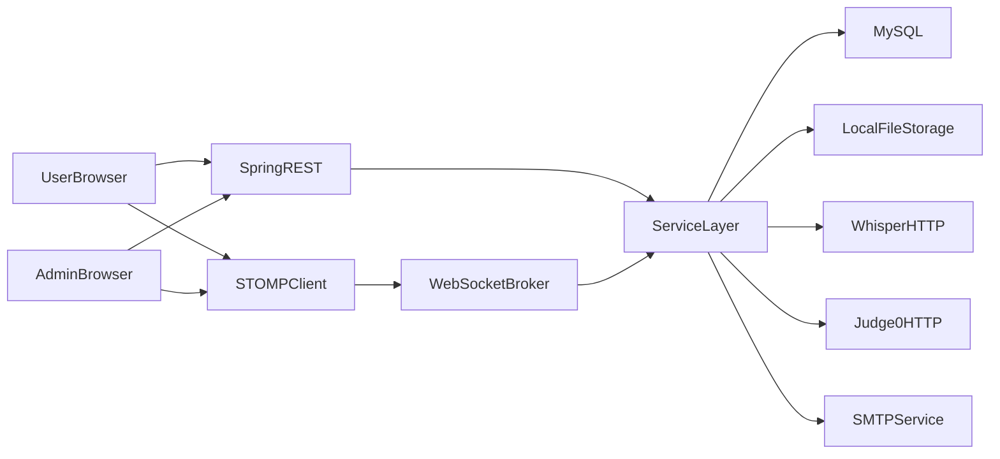
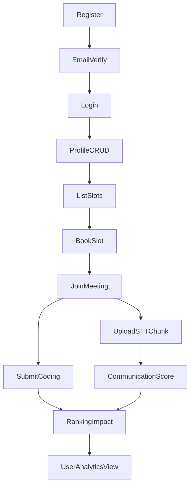
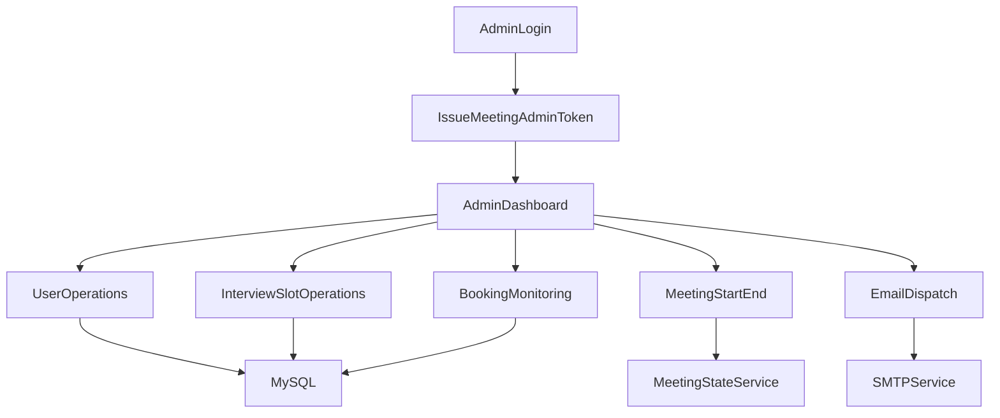
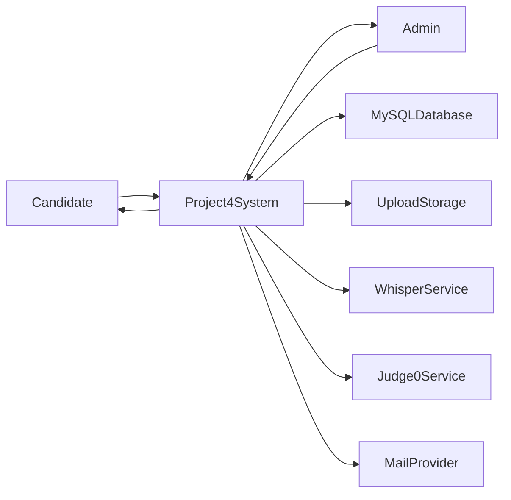
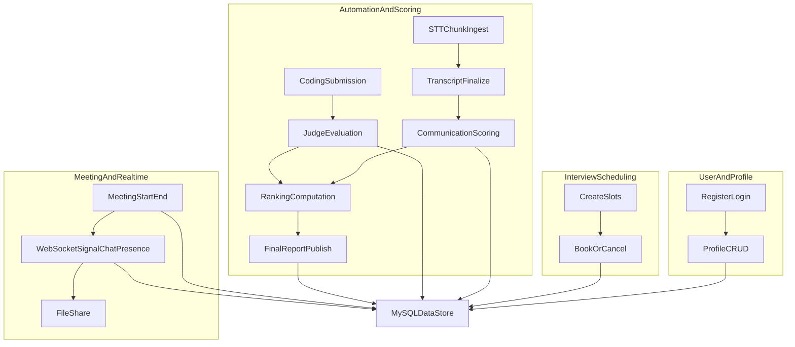
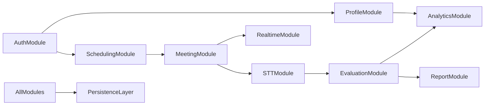
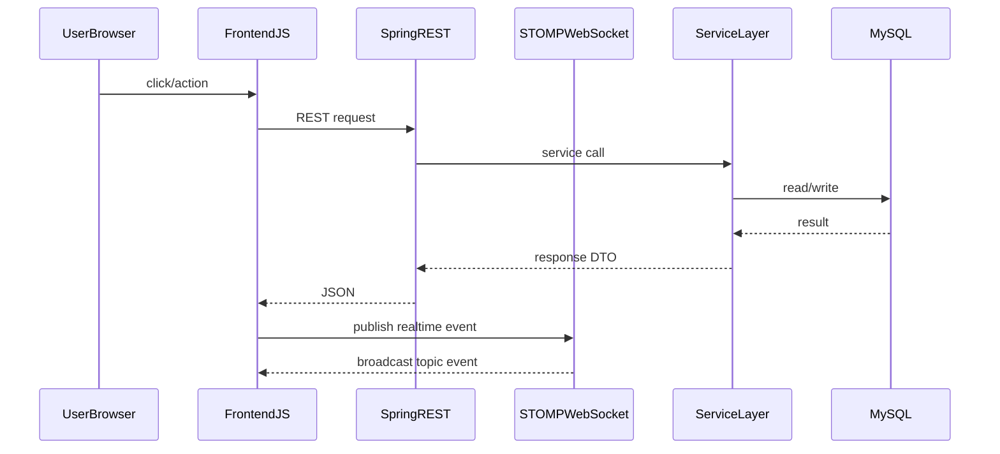
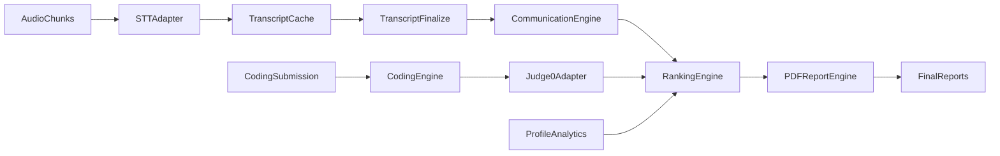
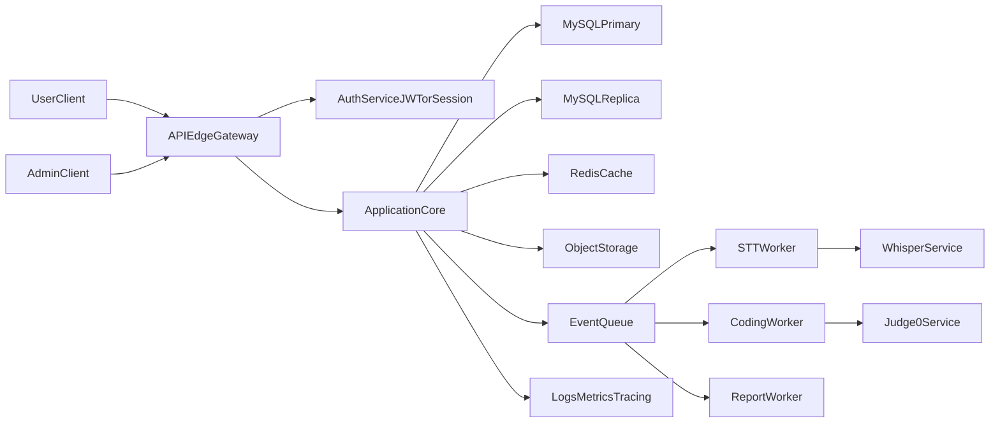

# SYSTEM ARCHITECTURE MASTER - Project4

## Scope and Intent

This document provides an implementation-grounded architecture design for `Project4`, with two views:

- **Current Implementation (As-Is):** Exactly how the current codebase works.
- **Recommended Target State (To-Be):** Industry-grade evolution for production readiness.

The diagrams and explanations are designed for thesis documentation, viva preparation, and practical engineering planning.

---

## 1) Project Overview

### Problem Statement

Recruitment and interview operations often run across disconnected tools: profile forms, scheduling sheets, video platforms, and manual score sheets. This causes:

- inconsistent candidate evaluation,
- poor traceability,
- high administrative overhead,
- weak data-driven decision making.

### Solution Approach

Project4 implements a unified platform that combines:

- user onboarding and profile management,
- interview slot scheduling and booking,
- real-time meeting collaboration (WebRTC + WebSocket),
- automated interview analysis (STT + communication scoring),
- coding assessment,
- ranking and final report generation.

### Key Features

- User registration + email verification + login.
- Rich profile CRUD with document upload.
- Admin user lifecycle management (activate/deactivate/delete).
- Interview slot creation and booking management.
- Meeting orchestration with `NORMAL` and `SCHEDULED` modes.
- STOMP chat/signal/presence/control channels.
- STT chunk ingest and transcript finalization.
- Communication score + weighted ranking + coding submissions.
- PDF final report generation and optional email distribution.

### Target Users

- **Primary user:** Candidate/student/job seeker.
- **Operational user:** Admin/recruitment coordinator/interviewer.
- **Institutional user:** Placement cell, training center, HR operations.

---

## 2) Complete System Architecture

### High-Level Architecture (Current Implementation)



### Core Interaction Model

1. Browser pages from `static/` call REST endpoints for CRUD and orchestration.
2. Meeting real-time events use `/ws` (SockJS + STOMP):
   - client sends to `/app/...`,
   - server broadcasts to `/topic/...`.
3. Service layer coordinates:
   - JPA repositories for MySQL persistence,
   - local filesystem for uploads,
   - external HTTP services for STT/Judge0,
   - SMTP for notifications.

### Architecture Notes (As-Is)

- Security filter chain permits all requests (`anyRequest().permitAll()`).
- User identity is largely client-held (`sessionStorage`/`localStorage` user object).
- Admin meeting actions are guarded by `X-Meeting-Admin-Token`.
- Topology hint is mesh (`app.meeting.topology=mesh`) for WebRTC clients.

---

## 3) User Flow Architecture

### End-to-End User Journey



### Authentication Flow (As-Is)

1. `POST /api/users/login` returns user payload (`id`, `username`, `email`, `verified`).
2. Frontend stores this in browser storage.
3. Subsequent user routes use `userId` in path/body.
4. No server-side session/JWT enforcement at filter level.

### User Action Data Flow

- Profile actions -> `ProfileCrudController` -> `ProfileCrudService` + file storage -> MySQL.
- Booking actions -> `InterviewController` -> `InterviewService` -> `interview_slots`/`interview_bookings`.
- Meeting actions -> `MeetingController` + `MeetingWsController` -> state/chat/presence services.
- Analytics -> `ProfileAnalyticsController` + `InterviewUpgradeController` -> aggregated scores/results.

---

## 4) Admin Flow Architecture

### Admin Control Flow



### Admin Dashboard Functional Areas

- **User management:** list, activate, deactivate, delete.
- **Talent analytics:** pool and location insights.
- **Interview operations:** create/delete slots, bookings, calendar summaries.
- **Meeting operations:** start/end meeting with mode-specific constraints.
- **Communication tools:** send emails with optional attachment.

### Role-Based Access (As-Is vs To-Be)

- **As-Is:** Partial guardrails (`meetingAdminToken` and WebSocket control sender role checks).
- **To-Be:** Enforce full RBAC in Spring Security (`ROLE_ADMIN`, `ROLE_USER`) for all admin APIs.

---

## 5) Detailed Data Flow Diagrams (DFD)

### Level 0 (Context Diagram)



### Level 1 (Detailed Processing)



---

## 6) Module Breakdown

| Module | Responsibility | Key Interfaces |
|---|---|---|
| Auth & Identity | Register, verify, login, password hashing | `UserController`, `UserService`, `EmailService` |
| Admin Access | Admin login and management operations | `AdminController`, `AdminService` |
| Profile Management | CRUD profile entities and uploads | `ProfileCrudController`, `ProfileCrudService`, `UserProfileService` |
| Interview Scheduling | Slot lifecycle and booking lifecycle | `InterviewController`, `AdminInterviewController`, `InterviewService` |
| Meeting Orchestration | Meeting state, rtc config, file share | `MeetingController`, `MeetingStateService`, `MeetingRtcConfigService` |
| Realtime Collaboration | Signal/chat/presence/control channels | `MeetingWsController`, `MeetingChatService`, `MeetingPresenceService` |
| STT Pipeline | Chunk dedup, transcript accumulation/finalize | `MeetingSttController`, `MeetingSttService` |
| Evaluation Engine | Communication score, ranking, coding, reports | `InterviewUpgradeController`, `InterviewUpgradeService` |
| Analytics | User and talent analytics | `ProfileAnalyticsController`, `ProfileAnalyticsService` |
| File Delivery | Serve uploaded artifacts | `FileController`, `FileStorageService` |
| Error Handling | Global error envelopes | `GlobalExceptionHandler` |

### Module Communication Map



---

## 7) Database Design

### ER Diagram (Current Core Model)

```mermaid
erDiagram
  USERS ||--o| USER_PROFILE : has
  USERS ||--o{ USER_EDUCATION : owns
  USERS ||--o{ USER_EXPERIENCE : owns
  USERS ||--o{ USER_PROGRAMMING_LANGUAGES : owns
  USERS ||--o{ USER_CERTIFICATES : owns
  USERS ||--o{ USER_DOCUMENTS : owns
  USERS ||--o{ USER_SKILLS : owns
  USERS ||--o{ INTERVIEW_BOOKINGS : books
  INTERVIEW_SLOTS ||--o{ INTERVIEW_BOOKINGS : contains
  INTERVIEW_BOOKINGS ||--o| INTERVIEW_SESSIONS : has
  USERS ||--o{ CODING_SUBMISSIONS : submits
  CODING_CHALLENGES ||--o{ CODING_SUBMISSIONS : receives
  INTERVIEW_BOOKINGS ||--o{ CODING_SUBMISSIONS : links
  RANKING_WEIGHTS ||--|| FINAL_REPORTS : influences

  USERS {
    int id PK
    varchar username
    varchar email UK
    varchar password
    boolean is_verified
    boolean is_active
  }
  USER_PROFILE {
    int id PK
    int user_id UK_FK
    varchar first_name
    varchar city
    varchar current_course
  }
  INTERVIEW_SLOTS {
    int id PK
    datetime scheduled_at
    int duration_minutes
    int capacity
  }
  INTERVIEW_BOOKINGS {
    int id PK
    int slot_id FK
    int user_id FK
    varchar status
  }
  INTERVIEW_SESSIONS {
    bigint id PK
    int booking_id UK_FK
    decimal communication_score
    decimal final_score
    mediumtext transcript_text
  }
  CODING_CHALLENGES {
    bigint id PK
    varchar title
    varchar language
    boolean active
  }
  CODING_SUBMISSIONS {
    bigint id PK
    int booking_id FK
    bigint challenge_id FK
    int user_id FK
    varchar status
    decimal score
  }
  FINAL_REPORTS {
    bigint id PK
    timestamp generated_at
    varchar report_path
  }
```

### Table Design Decisions

- **Normalization:** profile subdomains split into dedicated tables to avoid sparse mega-table.
- **Cascade deletes:** booking/profile artifacts tied to user/slot lifecycle with FK cascade.
- **Unique constraints:** one booking per `(slot_id, user_id)` and one session per booking.
- **Operational analytics:** dedicated tables for `meeting_chat_messages`, `admin_email_logs`, `geocode_cache`.
- **Config data in DB:** `ranking_weights` persisted for runtime tuning without redeploy.

---

## 8) API Design

### API Grouping by Module

#### Auth and User

| Method | Endpoint | Purpose |
|---|---|---|
| POST | `/api/users/register` | Register user and send verification email |
| GET | `/api/users/verify` | Verify email token |
| POST | `/api/users/login` | Authenticate user |
| GET | `/api/users/{id}` | Fetch user |
| PUT | `/api/users/{id}/email` | Update user email |

#### Admin Core

| Method | Endpoint | Purpose |
|---|---|---|
| POST | `/api/admin/login` | Admin authentication + meeting token |
| GET | `/api/admin/talent/analytics` | Talent pool analytics |
| GET | `/api/admin/talent/locations` | Location analytics |
| GET | `/api/admin/users` | List users |
| POST | `/api/admin/users/{id}/activate` | Activate user |
| POST | `/api/admin/users/{id}/deactivate` | Deactivate user |
| DELETE | `/api/admin/users/{id}` | Delete user and linked data |
| POST | `/api/admin/email/send` | Send admin email (multipart) |

#### Interview Scheduling

| Method | Endpoint | Purpose |
|---|---|---|
| GET | `/api/interviews/slots` | User slot listing |
| GET | `/api/interviews/bookings/user/{userId}` | User booking list |
| POST | `/api/interviews/slots/{slotId}/book` | Book slot |
| POST | `/api/interviews/bookings/{bookingId}/cancel` | Cancel booking |
| GET | `/api/admin/interviews/slots` | Admin slot listing |
| POST | `/api/admin/interviews/slots` | Create slot |
| DELETE | `/api/admin/interviews/slots/{id}` | Delete slot |
| GET | `/api/admin/interviews/bookings` | List all bookings |
| GET | `/api/admin/interviews/calendar/summary` | Day-level calendar summary |
| GET | `/api/admin/interviews/calendar/date/{date}` | Bookings for specific date |

#### Profile and Files

| Method | Endpoint | Purpose |
|---|---|---|
| GET | `/api/users/{userId}/profile` | Read profile aggregate |
| PUT | `/api/users/{userId}/profile` | Update profile |
| POST | `/api/users/{userId}/profile/photo` | Upload profile photo |
| POST | `/api/users/{userId}/education` | Upsert education |
| DELETE | `/api/users/{userId}/education/{id}` | Delete education |
| POST | `/api/users/{userId}/experience` | Upsert experience |
| DELETE | `/api/users/{userId}/experience/{id}` | Delete experience |
| POST | `/api/users/{userId}/programming-languages` | Upsert language entry |
| DELETE | `/api/users/{userId}/programming-languages/{id}` | Delete language entry |
| POST | `/api/users/{userId}/certificates` | Upsert certificate |
| DELETE | `/api/users/{userId}/certificates/{id}` | Delete certificate |
| POST | `/api/users/{userId}/documents` | Upload/add document |
| DELETE | `/api/users/{userId}/documents/{id}` | Delete document |
| POST | `/api/users/{userId}/skills` | Upsert skill |
| DELETE | `/api/users/{userId}/skills/{id}` | Delete skill |
| GET | `/api/users/{userId}/profile/analytics` | User analytics payload |
| GET | `/api/files/{*path}` | Read uploaded file |

#### Meeting and Realtime Support

| Method | Endpoint | Purpose |
|---|---|---|
| GET | `/meeting/rtc-config` | ICE/STUN/TURN config |
| GET | `/meeting/chat/history` | Recent chat messages |
| POST | `/meeting/start` | Start meeting (`NORMAL` or `SCHEDULED`) |
| GET | `/meeting/status` | Meeting status and allowed users |
| POST | `/meeting/end` | End meeting |
| POST | `/meeting/upload` | Upload file to meeting |
| GET | `/meeting/files/{fileId}` | Fetch meeting file |
| POST | `/api/meeting/{bookingId}/stt/chunk` | STT chunk ingest |
| POST | `/api/meeting/{bookingId}/stt/finalize` | Finalize transcript |

#### Evaluation and Reporting

| Method | Endpoint | Purpose |
|---|---|---|
| POST | `/api/interview-upgrade/communication/score` | Compute communication score |
| GET | `/api/interview-upgrade/ranking/weights` | Get ranking weights |
| PUT | `/api/interview-upgrade/ranking/weights` | Update ranking weights |
| GET | `/api/interview-upgrade/ranking` | Build ranking list |
| GET | `/api/interview-upgrade/report/final` | View latest final report |
| POST | `/api/interview-upgrade/report/final/publish` | Generate/publish report |
| GET | `/api/interview-upgrade/report/final/user/{userId}` | User report position |
| GET | `/api/interview-upgrade/coding/challenges` | Active coding challenges |
| GET | `/api/interview-upgrade/coding/challenges/all` | All coding challenges |
| GET | `/api/interview-upgrade/coding/judge0/status` | Judge0 status |
| POST | `/api/interview-upgrade/coding/challenges` | Create challenge |
| POST | `/api/interview-upgrade/coding/submit` | Submit coding solution |

### WebSocket API (STOMP)

#### Client Send (`/app`)

- `/app/meeting/signal`
- `/app/meeting/chat`
- `/app/meeting/typing`
- `/app/meeting/end`
- `/app/meeting/presence/join`
- `/app/meeting/control`
- `/app/meeting/control/ack`

#### Client Subscribe (`/topic`)

- `/topic/meeting/signal`
- `/topic/meeting/chat`
- `/topic/meeting/typing`
- `/topic/meeting/presence`
- `/topic/meeting/control`
- `/topic/meeting/control/ack`

### Frontend to Backend Connection Pattern



---

## 9) AI/Bot Architecture (Automated Interview Analysis Pipeline)

### Clarification

Project4 does not include a conversational chatbot service. The "AI/Bot" capability is an **automation and evaluation pipeline**.

### Internal Pipeline



### Input -> Processing -> Output

- **Input:** audio chunks, transcript text, coding code, profile stats, manual scores.
- **Processing:** deduplication, STT conversion, NLP-lite communication metrics, coding result evaluation, weighted ranking.
- **Output:** per-session scores, ranked list, report artifacts, user position endpoints.

### External Models/APIs Used

- Whisper-compatible HTTP endpoint for speech transcription.
- Judge0-compatible endpoint for remote code execution and evaluation.

---

## 10) Tech Stack Justification

| Layer | As-Is Choice | Why It Is Reasonable | Target-State Note |
|---|---|---|---|
| Backend | Spring Boot 3 + Java 17 | Mature ecosystem, rapid monolithic delivery, integrated REST/WebSocket/JPA | Keep core, modularize boundaries |
| Database | MySQL | Strong relational consistency for bookings and scoring | Add read replicas as load grows |
| Frontend | Static HTML/JS | Fast iteration, low operational complexity | Consider SPA framework for large teams |
| Realtime | STOMP + SockJS + WebRTC mesh | Practical for small group sessions | Move to SFU for scale |
| File Storage | Local disk | Simple and fast for local deployment | Migrate to object storage (S3-like) |
| STT | External Whisper HTTP | Decouples heavy inference from app server | Add queue + retry + observability |
| Coding Judge | Optional Judge0 | Standardized evaluation and isolation | Harden with async workers |
| Reporting | OpenPDF/iText + XChart | Server-side deterministic report generation | Versioned report templates |

---

## 11) Folder Structure

### Backend + Resources

```text
Project4/
  pom.xml
  src/main/java/com/example/authadmin/
    config/
      SecurityConfig.java
      WebSocketConfig.java
      GlobalExceptionHandler.java
    controller/
      UserController.java
      AdminController.java
      InterviewController.java
      AdminInterviewController.java
      ProfileCrudController.java
      ProfileAnalyticsController.java
      MeetingController.java
      MeetingWsController.java
      MeetingSttController.java
      InterviewUpgradeController.java
      FileController.java
      HomeController.java
    service/
      UserService.java
      InterviewService.java
      MeetingStateService.java
      MeetingSttService.java
      InterviewUpgradeService.java
      ProfileAnalyticsService.java
      ...
    repository/
      *Repository.java
    entity/
      User.java
      InterviewSlot.java
      InterviewBooking.java
      InterviewSession.java
      CodingChallenge.java
      CodingSubmission.java
      FinalReport.java
      ...
    dto/
      UserDtos.java
      InterviewDtos.java
      InterviewUpgradeDtos.java
      MeetingDtos.java
      ...
  src/main/resources/
    application.properties
    schema.sql
    schema-migration.sql
    data.sql
    static/
      login.html
      common/
        meeting.js
        profile-analytics.js
      user/
        *.html
        js/*.js
      admin/
        *.html
        js/*.js
  docs/
    API_DOCUMENTATION.md
    PROJECT_DOCUMENTATION.md
    ENGINEERING_THESIS.md
    SYSTEM_ARCHITECTURE_MASTER.md
```

### Purpose of Important Areas

- `controller/`: HTTP/STOMP entry points.
- `service/`: business orchestration and integrations.
- `repository/`: persistence abstraction via JPA.
- `entity/`: database model mapping.
- `dto/`: transport models for API contracts.
- `resources/static/`: browser application pages and scripts.

---

## 12) Visualization Set (Quick Index)

This file includes:

1. High-Level Architecture
2. User Flow Diagram
3. Admin Flow Diagram
4. DFD Level 0
5. DFD Level 1
6. Module Communication Map
7. ER Diagram
8. Frontend-Backend Sequence Diagram
9. Automation Pipeline Diagram

---

## 13) Production Target-State Architecture (To-Be)

### Target Architecture Diagram



### Key Upgrades

#### Security and Access Control

- Replace `permitAll` with explicit route authorization.
- Add authenticated context (JWT or session cookie).
- Enforce object-level authorization (`userId` ownership checks).
- Add role model: `ROLE_USER`, `ROLE_ADMIN`, `ROLE_REVIEWER`.
- Add token rotation and secure admin session management.

#### Scalability and Reliability

- Introduce async workers for STT, coding, and report generation.
- Move uploads from local disk to object storage.
- Add Redis for hot data (meeting status, rate limit, sessions).
- Consider SFU architecture for large multi-party meetings.

#### Data and API Governance

- Add API versioning (`/api/v1`).
- Add OpenAPI spec generation and contract tests.
- Add idempotency keys for critical writes (booking, report publish).

#### Observability

- Structured logs + correlation IDs.
- Metrics: STT latency, coding evaluation latency, meeting join errors.
- Distributed tracing across REST and workers.
- Alerting on error-rate and SLA thresholds.

#### Quality and Delivery

- Strengthen CI gates (test coverage threshold, static analysis).
- Add integration tests for WebSocket and scheduler workflows.
- Add migration automation (Flyway or Liquibase).

### Migration Roadmap

1. **Phase 1:** Security hardening and ownership checks.
2. **Phase 2:** Object storage + API versioning + observability baseline.
3. **Phase 3:** Async pipeline for STT/coding/report.
4. **Phase 4:** SFU and horizontal scaling patterns.

---

## Current Implementation Caveats (Important for Thesis Accuracy)

- API-level authorization is not fully enforced in current filter chain.
- Browser storage is used as identity context for user flows.
- Some secrets are present as fallback defaults in properties and should be environment-managed in real deployments.
- Real-time and meeting flows are designed for moderate concurrency under mesh assumptions.

---

## Thesis and Documentation Usage Notes

- Use **As-Is** sections when defending what is implemented now.
- Use **To-Be** sections to demonstrate system-design maturity and production thinking.
- Reuse the diagrams directly in thesis chapters for architecture, DFD, and database design.

